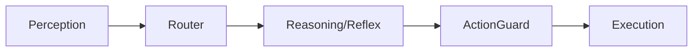

这份文档详细整理了 Neko-Light 从 **“被动式智能开关”** 进化为 **“主动式伴侣 Agent”** 的完整升级路线图，并与原 `README.md` 进行了详细对比。

---

# Neko-Light 系统升级蓝图 (V2.0)

## 1. 核心理念对比

| 维度       | 原版 (README V1.0)                           | 升级版 (V2.0 目标)                                | 核心差异                                 |
|:-------- |:------------------------------------------ |:-------------------------------------------- |:------------------------------------ |
| **交互模式** | **被动响应** (Request-Response)<br>用户输入 -> 系统动 | **主动交互** (Event-Driven)<br>时间/状态/用户触发 -> 系统动 | 引入 **OODA 循环** (观察-调整-决策-行动)         |
| **记忆能力** | **仅动作库** (RAG)<br>只记得"怎么做动作"               | **混合记忆系统**<br>动作库 + 用户画像 + 长期情节记忆            | 引入 **双路 RAG** (Action + User Memory) |
| **思考深度** | **线性流程**<br>感知 -> 路由 -> 执行                 | **动态规划**<br>意图扩展 -> 工具调用 -> 任务拆解 -> 审查       | 增加 **Query Rewrite** 和 **Tool Use**  |
| **架构形态** | **有向无环图 (DAG)**<br>单次运行即结束                 | **无限循环 (Infinite Loop)**<br>后台常驻，自主运行        | 主程序改为 `while True` 事件循环              |

---

## 2. 架构设计升级

### 2.1 逻辑架构图变更

**原版架构 (Linear):**



**升级版架构 (The "Brain-Cerebellum" Loop):**

```mermaid
graph TD
    %% 外部输入与内部驱动
    User[用户输入] --> EventBus
    Timer[定时器] --> EventBus
    Sensors[传感器] --> EventBus
    InternalState[内部状态(无聊/饥饿)] --> EventBus

    %% 全局评估 (新入口)
    EventBus --> Evaluator[全局评估器]

    %% 记忆加载 (新增)
    Evaluator --> MemoryLoader[记忆读取 & 查询重写]

    %% 路由分发
    MemoryLoader --> Router{智能路由}

    %% 快路径 (小脑)
    Router -->|反射| Reflex[反射节点]

    %% 慢路径 (大脑) - 支持工具
    Router -->|复杂任务| Reasoning[推理节点 (CoT + Tools)]
    Reasoning -->|调用外部API| ToolNode[工具节点]
    ToolNode --> Reasoning

    %% 执行与反馈
    Reflex --> ActionGuard
    Reasoning --> ActionGuard
    ActionGuard --> Execution[执行节点]

    %% 闭环反馈
    Execution -->|更新状态/写入记忆| InternalState
```

---

## 3. 具体修改清单 (按文件)

为了实现从 V1 到 V2 的跨越，以下是必须修改的代码文件及其具体内容：

### 📁 `state.py` (状态定义)

**目标**：支持长期记忆和内部驱动力。

- [ ] **新增 `user_profile` 字段**：存储静态画像（如 `{"name": "Jack", "city": "Beijing"}`}）。
- [ ] **新增 `internal_drives` 字段**：存储 `boredom` (无聊度), `energy` (能量值), `last_interaction_time`。
- [ ] **新增 `memory_context` 字段**：用于存放 RAG 检索回来的“用户历史偏好”（如红烧肉记忆）。
- [ ] **升级 `history`**：确保兼容 LangChain 的 `BaseMessage` 列表，支持 ToolMessage。

### 📁 `nodes.py` (核心逻辑)

这是改动最大的部分。

#### 1. 新增 `evaluator_node` (全局评估)

- **功能**：作为图的入口。判断事件来源是“用户说话”还是“定时器触发”。
- **逻辑**：如果是定时器且无事发生，直接结束；如果是 `boredom > 80`，生成“主动搭讪”的意图。

#### 2. 升级 `reasoning_node` (推理大脑)

- **支持 Query Expansion (意图扩展)**：
  - *原逻辑*：直接用 `user_input` 查向量库。
  - *新逻辑*：先让 LLM 把 `user_input` ("我饿了") 转化为 `search_query` ("User food preferences")，再去查向量库。
- **集成记忆注入**：将检索到的 `memory_context` 拼接到 System Prompt 中。

#### 3. 升级 `router_node` (路由)

- **技术升级**：从简单的 Prompt 分类改为 **Function Calling (Structured Output)**。
- **功能**：精确区分 `Reflex` (反射)、`Reasoning` (推理) 和 `Ignore` (忽略)。

#### 4. 升级 `execution_node` (执行)

- **增加记忆写入**：如果 LLM 的回复中包含“用户新喜好”，调用向量库的 `add_documents` 存入新记忆。
- **增强 Guard**：实现“翻译层”，把抽象指令（如 `mood="angry"`）翻译成具体的电机参数。

#### 5. 新增 `tool_node` (可选但推荐)

- **功能**：如果需要联网（天气、新闻），集成 LangGraph 的 `ToolNode`。

### 📁 `graph.py` (工作流构建)

- [ ] **注册新节点**：添加 `evaluator`, `memory_loader`, `tool_node`。
- [ ] **重构连接边**：
  - `START` -> `evaluator`
  - `reasoning` <-> `tool_node` (循环边)
  - `execution` -> `END` (或者直接更新状态准备下一次 Loop)

### 📁 `main.py` (运行入口)

**目标**：从单次运行改为事件驱动循环。

- [ ] **移除**：`input()` 阻塞式等待。

- [ ] **新增 Event Loop**：
  
  ```python
  while True:
      # 1. 获取事件 (用户输入 or 定时器 tick)
      event = event_manager.get_event()
  
      # 2. 更新内部状态 (如无聊值 +1)
      current_state = update_internal_state(current_state)
  
      # 3. 只有当有事发生时才 Invoke 图
      if event or current_state['boredom'] > threshold:
          app.invoke(inputs)
  
      time.sleep(0.1) # 防止死循环占用 CPU
  ```

### 📁 向量数据库 (ChromaDB)

- [ ] **新增集合**：除了原有的 `action_library`，新增 `user_memory` 集合。
- [ ] **元数据管理**：为记忆添加时间戳和分类 tag (e.g., `category: food`)。

---

## 4. 场景模拟验证

### 场景 A：主动性 (Proactivity)

* **触发**：早晨 8:00，用户没说话。
* **流程**：`Timer Event` -> `Evaluator` (检测到是早晨模式) -> `Reasoning` (检索 RAG: 早上该干嘛？) -> `Plan` (开暖光，放轻音乐) -> `Execute`。

### 场景 B：记忆回溯 (The "Red Braised Pork" Case)

* **触发**：用户说“我饿了”。
* **流程**：
  1. `Evaluator` 接收语音。
  2. `Reasoning` 内部思考：“用户说饿了，我得查查他爱吃什么”。
  3. **Query Rewrite**: 生成检索词 "User favorite food"。
  4. **RAG**: 从 `user_memory` 检索到 "2天前用户说想吃红烧肉"。
  5. **Generate**: 生成回复 "要不要试试你前两天念叨的红烧肉？"。

### 场景 C：复杂任务 (Planning)

* **触发**：用户说“我要专心学习”。
* **流程**：
  1. `Router` 识别为复杂任务 -> `Reasoning`。
  2. `Reasoning` 查阅 `action_library` 里的“专注模式 SOP”。
  3. `Plan` 生成序列：`[关窗帘, 调冷光, 开启番茄钟]`。
  4. `Guard` 检查：当前电量充足，允许执行。
  5. `Execute` 执行并更新状态。

---

## 5. 总结

这次升级不是推翻重来，而是**“加装”**。

1. **加装“小脑”**：Event Loop 处理实时信号。
2. **加装“海马体”**：User Memory RAG 存储长期记忆。
3. **加装“前额叶”**：Global Evaluator 决定什么时候该主动出击。

升级后的 Neko-Light 将不再是一个冷冰冰的遥控台灯，而是一个有记忆、有性格、会主动关怀的**具身智能 (Embodied AI)**。
