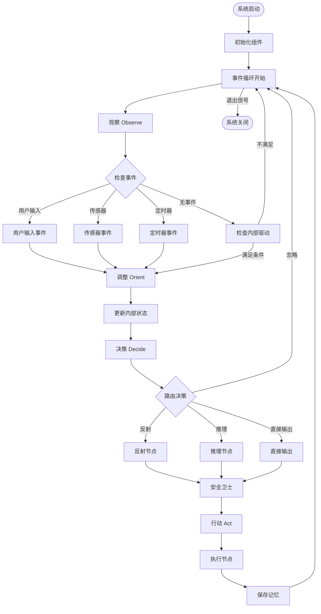
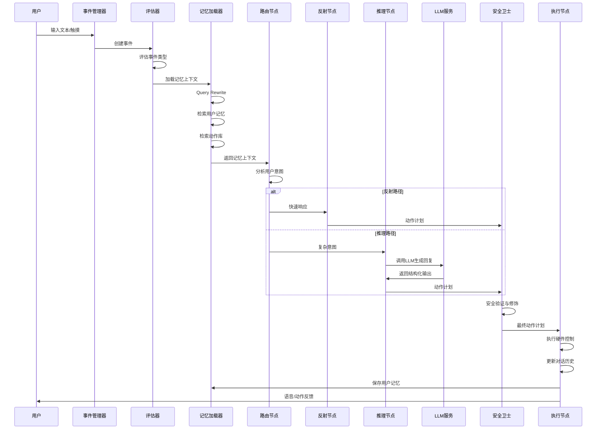
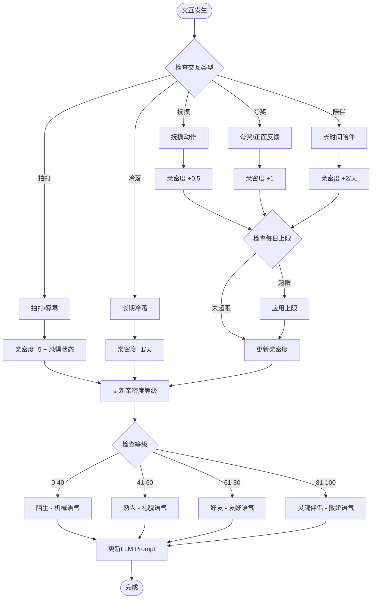
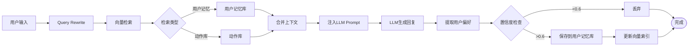

# Project Animus 架构设计蓝图

## 1. 核心流程图

### 1.1 主事件循环流程 (OODA循环)



### 1.2 对话处理流程



### 1.3 亲密度系统流程



### 1.4 记忆系统流程



---

## 2. 组件交互说明

### 2.1 核心模块架构

```
┌─────────────────────────────────────────────────────────┐
│                    应用层 (Application)                   │
│  ┌──────────────┐  ┌──────────────┐  ┌──────────────┐  │
│  │  main.py     │  │  graph.py    │  │  state.py    │  │
│  │  (事件循环)   │  │  (工作流图)   │  │  (状态定义)   │  │
│  └──────────────┘  └──────────────┘  └──────────────┘  │
└─────────────────────────────────────────────────────────┘
                          │
        ┌─────────────────┼─────────────────┐
        │                 │                 │
┌───────▼──────┐  ┌───────▼──────┐  ┌───────▼──────┐
│ 事件管理层    │  │ 状态管理层    │  │ 节点执行层    │
│              │  │              │  │              │
│ event_manager│  │state_manager │  │   nodes.py   │
│              │  │              │  │              │
│ - 事件队列   │  │ - 状态初始化 │  │ - evaluator  │
│ - 事件分发   │  │ - 状态更新   │  │ - perception │
│ - 定时器     │  │ - 状态持久化 │  │ - router     │
│ - 传感器接口 │  │              │  │ - reflex     │
└──────────────┘  └──────────────┘  │ - reasoning  │
                                     │ - guard      │
                                     │ - execution  │
                                     └──────────────┘
                          │
        ┌─────────────────┼─────────────────┐
        │                 │                 │
┌───────▼──────┐  ┌───────▼──────┐  ┌───────▼──────┐
│ 记忆管理层    │  │ 工具服务层    │  │ 硬件控制层    │
│              │  │              │  │              │
│memory_manager│  │   tools.py   │  │ (模拟/真实)  │
│              │  │              │  │              │
│ - 向量数据库 │  │ - 天气查询   │  │ - 灯光控制   │
│ - Query重写  │  │ - 时间查询   │  │ - 电机控制   │
│ - 记忆检索   │  │ - 计算工具   │  │ - 声音播放   │
│ - 记忆保存   │  │ - 新闻查询   │  │              │
└──────────────┘  └──────────────┘  └──────────────┘
        │                 │
┌───────▼─────────────────▼───────┐
│        外部服务层                 │
│  ┌──────────┐  ┌──────────┐     │
│  │ LLM API  │  │ Embedding│     │
│  │ (DeepSeek│  │ (Ollama) │     │
│  │  v3)     │  │          │     │
│  └──────────┘  └──────────┘     │
│  ┌──────────┐  ┌──────────┐     │
│  │ ChromaDB │  │ TTS服务   │     │
│  │ (向量库)  │  │ (可选)    │     │
│  └──────────┘  └──────────┘     │
└─────────────────────────────────┘
```

### 2.2 模块间调用关系

#### 2.2.1 事件驱动流程

```
main.py (事件循环)
    │
    ├─→ EventManager.get_event()
    │       │
    │       ├─→ 检查用户输入
    │       ├─→ 检查传感器
    │       └─→ 检查定时器
    │
    ├─→ StateManager.update_internal_state()
    │       │
    │       ├─→ 更新无聊度
    │       ├─→ 更新能量值
    │       └─→ 更新离开时长
    │
    └─→ Graph.invoke(state)
            │
            ├─→ evaluator_node
            │       │
            │       └─→ 判断是否继续处理
            │
            ├─→ memory_loader_node
            │       │
            │       └─→ MemoryManager.retrieve_memory_context()
            │
            ├─→ perception_node
            │       │
            │       └─→ 读取内部状态
            │
            ├─→ router_node
            │       │
            │       └─→ 路由决策
            │
            ├─→ reflex_node / reasoning_node
            │       │
            │       ├─→ LLM调用 (reasoning)
            │       └─→ 硬编码响应 (reflex)
            │
            ├─→ action_guard_node
            │       │
            │       └─→ 安全验证
            │
            └─→ execution_node
                    │
                    ├─→ 执行硬件控制
                    ├─→ 更新对话历史
                    └─→ MemoryManager.save_user_memory()
```

#### 2.2.2 记忆系统调用

```
memory_loader_node
    │
    └─→ MemoryManager.retrieve_memory_context()
            │
            ├─→ query_rewrite() → LLM
            │
            ├─→ retrieve_user_memory() → ChromaDB
            │
            └─→ retrieve_action_library() → ChromaDB

execution_node
    │
    └─→ MemoryManager.save_user_memory()
            │
            ├─→ extract_user_preference() → LLM
            │
            └─→ save_user_memory() → ChromaDB
```

#### 2.2.3 亲密度系统调用

```
StateManager.update_internal_state()
    │
    └─→ 计算离开时长
            │
            └─→ 更新无聊度

execution_node
    │
    ├─→ 检测交互类型
    │       │
    │       ├─→ 抚摸 → 亲密度 +0.5
    │       ├─→ 夸奖 → 亲密度 +1
    │       ├─→ 拍打 → 亲密度 -5
    │       └─→ 冷落 → 亲密度 -1
    │
    └─→ 更新亲密度等级
            │
            └─→ 更新LLM Prompt (根据等级)
```

### 2.3 数据流

```
用户输入/传感器事件
    ↓
EventManager (事件队列)
    ↓
StateManager (状态更新)
    ↓
LampState (状态对象)
    ↓
Graph.invoke(state)
    ↓
各节点处理
    ↓
更新 LampState
    ↓
StateManager.save_state() (持久化)
    ↓
JSON文件 / 向量数据库
```

---

## 3. 技术选型与风险

### 3.1 核心技术栈

#### 3.1.1 工作流引擎
- **技术**：LangGraph
- **理由**：支持状态图、条件路由、循环处理，完美适配OODA架构
- **风险**：学习曲线中等，需要理解状态管理机制
- **缓解**：使用TypedDict定义状态，确保类型安全

#### 3.1.2 LLM服务
- **技术**：DeepSeek v3 (通过VolcEngine API)
- **理由**：性能优秀，支持Function Calling，成本可控
- **风险**：API依赖，网络延迟，Token成本
- **缓解**：
  - 实现本地缓存机制
  - 使用反射路径减少LLM调用
  - 设置超时和重试机制

#### 3.1.3 向量数据库
- **技术**：ChromaDB + Ollama Embeddings (bge-m3)
- **理由**：
  - ChromaDB：轻量级，易于部署，支持持久化
  - Ollama：本地运行，无需API，隐私安全
- **风险**：
  - 本地Embedding模型性能可能不如云端
  - ChromaDB在大数据量下性能下降
- **缓解**：
  - 使用Query Rewrite优化检索
  - 限制检索数量（k=3）
  - 定期清理无效记忆

#### 3.1.4 状态管理
- **技术**：Python TypedDict + JSON持久化
- **理由**：简单直接，易于调试，无需额外依赖
- **风险**：大规模状态管理可能性能问题
- **缓解**：只持久化关键字段，对话历史限制长度

#### 3.1.5 事件管理
- **技术**：Python queue + threading
- **理由**：标准库，无需额外依赖
- **风险**：多线程调试复杂
- **缓解**：使用单线程事件循环，避免竞态条件

### 3.2 技术风险矩阵

| 风险项 | 影响 | 概率 | 严重性 | 缓解措施 |
|:---|:---|:---|:---|:---|
| LLM API故障 | 高 | 中 | 高 | 实现降级方案（反射路径），本地缓存 |
| 向量检索不准确 | 中 | 中 | 中 | Query Rewrite优化，提高检索质量 |
| 状态持久化失败 | 中 | 低 | 中 | 定期备份，异常处理 |
| 内存泄漏 | 高 | 低 | 高 | 限制历史长度，定期清理 |
| 硬件接口故障 | 高 | 低 | 高 | 模拟模式，异常捕获 |
| 网络延迟 | 中 | 中 | 中 | 超时设置，异步处理 |

### 3.3 性能指标

#### 3.3.1 响应时间目标
- **反射路径**：< 100ms（本地处理）
- **简单对话**：< 1.5s（LLM调用）
- **复杂推理**：< 5s（包含RAG检索）

#### 3.3.2 资源消耗目标
- **内存**：< 500MB（不含向量数据库）
- **CPU**：空闲时 < 5%，活跃时 < 30%
- **存储**：向量数据库 < 100MB（MVP阶段）

### 3.4 扩展性考虑

#### 3.4.1 水平扩展
- 当前架构为单机部署
- 未来可考虑：
  - 向量数据库独立服务（Chroma Server）
  - LLM服务负载均衡
  - 事件处理分布式队列

#### 3.4.2 垂直扩展
- 模块化设计，易于替换组件
- 接口抽象，支持不同实现
- 配置化，支持不同部署环境

### 3.5 安全与隐私

#### 3.5.1 数据安全
- **本地优先**：所有数据优先存储在本地
- **加密存储**：敏感信息加密存储
- **访问控制**：状态文件权限控制

#### 3.5.2 隐私保护
- **本地Embedding**：使用Ollama本地模型，不上传数据
- **选择性上传**：仅对话内容上传LLM，不包含用户画像
- **数据清理**：支持用户删除历史数据

---

## 4. 现有文件影响分析

### 4.1 需要修改的现有文件

#### 4.1.1 state.py
- **影响**：需要添加亲密度相关字段
- **修改内容**：
  - 添加 `intimacy_level: int` (0-100)
  - 添加 `intimacy_rank: str` (等级)
  - 添加 `intimacy_history: List[Dict]` (历史记录)

#### 4.1.2 nodes.py
- **影响**：需要添加亲密度计算逻辑
- **修改内容**：
  - `execution_node` 中添加亲密度更新逻辑
  - `reasoning_node` 中根据亲密度调整Prompt

#### 4.1.3 state_manager.py
- **影响**：需要添加亲密度初始化和管理
- **修改内容**：
  - `initialize_state()` 中初始化亲密度
  - 添加 `update_intimacy()` 方法

### 4.2 需要新增的文件

#### 4.2.1 intimacy_manager.py (新增)
- **功能**：亲密度系统管理
- **职责**：
  - 计算亲密度变化
  - 更新亲密度等级
  - 根据等级生成Prompt调整

#### 4.2.2 animation_controller.py (新增，可选)
- **功能**：动画控制（如果选择原型2或3）
- **职责**：
  - 管理屏幕动画
  - 控制表情显示
  - 处理视觉反馈

---

## 5. 实施优先级

### 5.1 MVP阶段（必须）
1. ✅ 核心OODA循环（已完成）
2. ✅ 记忆系统（已完成）
3. ⬜ 亲密度系统（新增）
4. ⬜ 主动行为机制（部分完成）

### 5.2 V1.1阶段（重要）
1. ⬜ 亲密度等级表现
2. ⬜ 回家欢迎仪式优化
3. ⬜ 闲时自娱自乐动画

### 5.3 V2.0阶段（增强）
1. ⬜ 视觉物体识别
2. ⬜ Agentic RAG
3. ⬜ 环境感知关怀

---

## 6. 测试策略

### 6.1 单元测试
- 亲密度计算逻辑
- 记忆检索准确性
- 路由决策正确性

### 6.2 集成测试
- 完整对话流程
- 亲密度变化流程
- 主动行为触发

### 6.3 性能测试
- 响应时间
- 内存使用
- 并发处理

---

**文档版本**：v1.0  
**最后更新**：2024-01-XX

