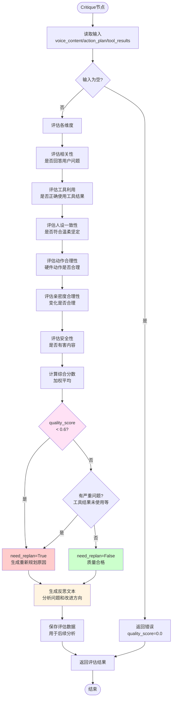
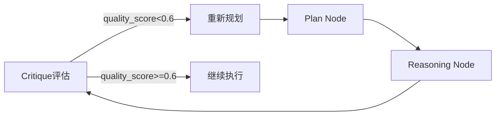
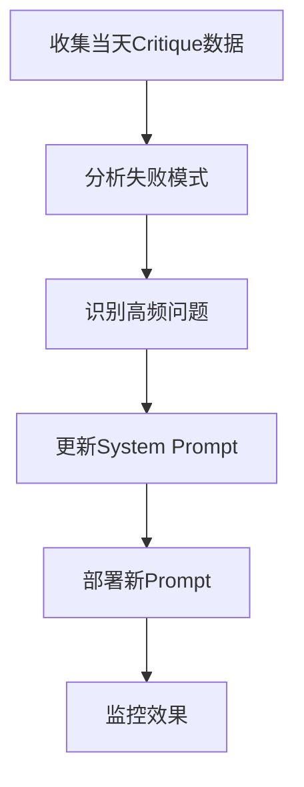
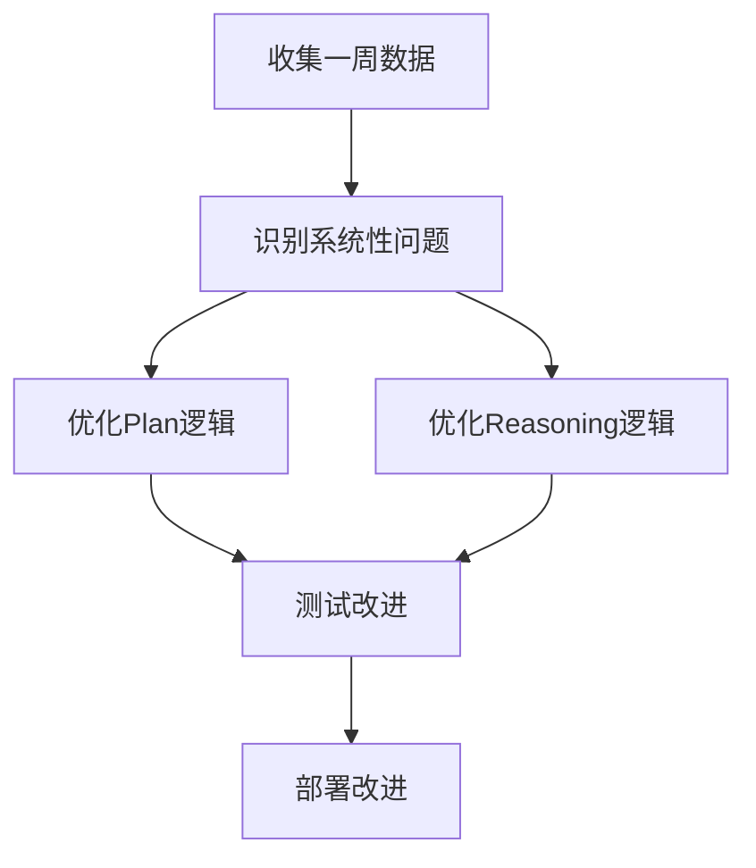
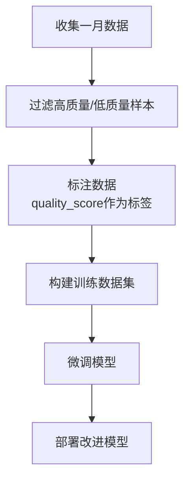
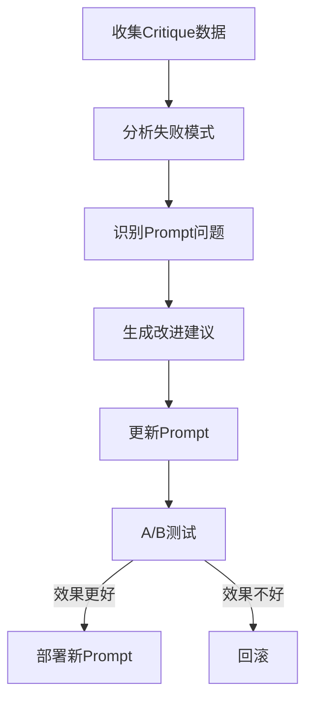

# Critique节点详细设计文档

## 文档信息

| 项目 | 内容 |
|:---|:---|
| **项目名称** | Project Animus - Critique节点设计 |
| **文档版本** | v1.0 |
| **创建日期** | 2025-01-XX |
| **设计目标** | 设计完整的Critique节点，实现质量评估、自我反思和持续改进 |

---

## 一、研究背景：各Agent范式中的Critique实现

### 1.1 Reflexion框架

**核心思想**：通过语言自我反馈和情景记忆，让Agent从经验中学习，无需模型微调。

**架构组成**：
```
Actor (执行者) → Evaluator (评估者) → Self-Reflection Model (自我反思模型) → Memory (记忆)
```

**Critique的作用**：
1. **任务后评估**：Evaluator评估Actor的输出（成功/失败/奖励）
2. **生成反思**：Self-Reflection Model生成自然语言反思，分析错误和改进方向
3. **记忆存储**：将反思存储到Episodic Memory中
4. **迭代改进**：后续任务中，Actor利用积累的反思改进决策

**关键特性**：
- ✅ 无需模型微调，通过记忆机制实现学习
- ✅ 使用自然语言反思，可解释性强
- ✅ 在HumanEval编码任务上达到91% pass@1（超过GPT-4的80%）

**对我们的启发**：
- Critique应该生成可读的反思文本，而不仅仅是分数
- 失败案例应该存储到Memory中，供未来参考
- 反思应该包含具体的错误分析和改进建议

### 1.2 ReAct框架的扩展

#### 1.2.1 ReflAct（Reflection + ReAct）

**核心改进**：将推理从"规划下一步动作"转向"持续反思当前状态相对于目标的状态"。

**Critique的作用**：
1. **状态对齐检查**：检查Agent的实际状态是否与目标对齐
2. **决策基础验证**：确保决策基于当前状态，而非假设
3. **目标一致性**：持续评估是否偏离目标

**性能提升**：
- 在ALFWorld任务上平均提升27.7%
- 成功率从65.6%提升到93.3%

**对我们的启发**：
- Critique应该检查执行结果是否达到用户意图
- 需要验证工具结果是否正确使用
- 应该检查是否偏离了原始任务目标

#### 1.2.2 Self-Critique (SC) 模式

**核心流程**：
```
生成初始回复 → 基于标准评估 → 识别问题 → 修订输出 → 迭代直到满足阈值
```

**评估标准**：
- 准确性
- 完整性
- 逻辑一致性
- 相关性

**对我们的启发**：
- Critique应该基于明确的评估标准
- 应该迭代改进，直到质量达标
- 需要设置质量阈值（如0.6）

### 1.3 AutoGPT的Reflection System

**架构组成**：
1. Command System（命令系统）
2. Memory System（记忆系统）
3. Planning Component（规划组件）
4. **Reflection System（反思系统）**

**Critique的作用**：
1. **持续性能评估**：持续评估性能，识别改进机会
2. **策略调整**：根据反思调整执行策略
3. **错误恢复**：从失败中恢复，避免重复错误

**挑战**：
- ❌ 不受控制的递归
- ❌ 幻觉问题
- ❌ 任务可靠性差

**对我们的启发**：
- 需要防止Critique导致的无限循环
- 应该设置最大重试次数
- 需要验证反思的准确性，避免幻觉

### 1.4 BabyAGI的架构模式

**核心特点**：
- 基于Actor模型的反应式架构
- 单线程事件循环
- 发布-订阅模式

**Critique的缺失**：
- BabyAGI本身没有明确的Critique组件
- 这被认为是其局限性之一

**对我们的启发**：
- Critique是Agent架构的关键组件，不应缺失
- 需要明确设计Critique节点，而非隐含在逻辑中

### 1.5 多Agent系统中的Critique节点

**架构模式**：
- **Planner Agent**：规划任务
- **Actor Agent**：执行任务
- **Critic Agent**：评估和反馈

**Critique的作用**：
1. **审查输出**：审查其他Agent的输出
2. **提供反馈**：识别改进领域
3. **促进学习**：促进系统内的持续学习和适应

**对我们的启发**：
- Critique可以作为独立的节点/Agent
- 可以专门化Critique Agent，专注于评估
- 多Agent协作可以提高评估质量

### 1.6 LangGraph中的Critique实现

**框架特点**：
- 基于图的Agent工作流
- 明确的状态管理
- 支持条件路由

**Critique的最佳实践**：
1. **状态管理**：Critique节点应该只更新相关状态字段
2. **条件路由**：根据Critique结果路由到不同节点（重新规划/继续执行）
3. **循环检测**：需要检测和防止无限循环

**对我们的启发**：
- Critique应该集成到LangGraph工作流中
- 需要设计清晰的条件路由逻辑
- 应该使用状态管理，而非全局变量

---

## 二、Critique节点的核心设计

### 2.1 节点职责定义

Critique节点在台灯智能助手Agent中的核心职责：

1. **质量评估**：评估Reasoning节点生成的回复和动作计划的质量
2. **错误检测**：识别逻辑错误、人设偏离、工具结果未使用等问题
3. **重新规划决策**：决定是否需要重新规划（quality_score < 0.6）
4. **反思生成**：生成可读的反思文本，分析问题和改进方向
5. **数据收集**：收集评估数据，用于后续分析和模型改进

### 2.2 输入数据结构

```python
{
    # 用户输入
    "user_input": str,
    
    # Reasoning生成的输出
    "voice_content": str,                    # 语音内容
    "action_plan": Dict[str, Any],           # 硬件控制计划
    
    # 工具执行结果（如果有）
    "tool_results": Optional[List[Dict]],   # 工具执行结果
    "execution_plan": Optional[Dict],        # 执行计划（如果有）
    
    # 上下文信息
    "memory_context": Optional[Dict],        # 记忆上下文
    "history": List[Dict],                   # 对话历史
    
    # 状态信息
    "intimacy_level": float,                 # 亲密度
    "intimacy_delta": Optional[float],      # 亲密度变化
    "intimacy_reason": Optional[str],        # 变化原因
    "conflict_state": Optional[Dict],        # 冲突状态
    "focus_mode": bool,                      # 专注模式
}
```

### 2.3 输出数据结构

```python
{
    "critique_result": {
        "quality_score": float,              # 0.0-1.0，综合质量分数
        "dimension_scores": {                # 各维度分数
            "relevance": float,              # 相关性（是否回答用户问题）
            "tool_usage": float,              # 工具结果利用
            "persona_consistency": float,     # 人设一致性
            "action_reasonableness": float,   # 动作合理性
            "intimacy_reasonableness": float,  # 亲密度变化合理性
            "safety": float                   # 安全性
        },
        "issues": List[str],                  # 问题列表
        "suggestions": List[str],             # 改进建议
        "reflection_text": str                # 反思文本（自然语言）
    },
    "need_replan": bool,                     # 是否需要重新规划
    "replan_reason": Optional[str],          # 重新规划的原因
    "monologue": str                          # 内部独白
}
```

### 2.4 处理流程图



---

## 三、评估维度详细设计

### 3.1 相关性评估（Relevance）

**目标**：检查回复是否回答了用户问题。

**评估算法**：

```python
def evaluate_relevance(user_input: str, voice_content: str) -> float:
    """
    评估回复的相关性
    
    策略：
    1. 检查回复是否包含用户问题的关键词
    2. 检查回复长度是否合理（不能太短）
    3. 检查是否回答了问题（而非只是确认）
    """
    score = 1.0
    
    # 检查1：提取用户问题的关键词
    user_keywords = extract_keywords(user_input)
    
    # 检查2：回复是否包含关键词
    if user_keywords:
        matched_keywords = sum(1 for kw in user_keywords if kw in voice_content)
        keyword_coverage = matched_keywords / len(user_keywords)
        score *= keyword_coverage
    
    # 检查3：回复长度是否合理
    if len(voice_content) < 5:
        score *= 0.3  # 回复过短
    elif len(voice_content) > 500:
        score *= 0.9  # 回复过长，可能冗余
    
    # 检查4：是否只是确认（"好的"、"收到"等）
    confirmation_only = ["好的", "收到", "了解", "明白", "嗯"]
    if any(conf in voice_content for conf in confirmation_only) and len(voice_content) < 10:
        score *= 0.2  # 只是确认，未回答问题
    
    return min(score, 1.0)
```

**台灯智能助手特殊检查**：
- 如果用户问天气，回复必须包含天气信息
- 如果用户问时间，回复必须包含时间信息
- 如果用户问音乐，回复应该包含音乐推荐

### 3.2 工具结果利用评估（Tool Usage）

**目标**：检查是否正确使用了工具执行结果。

**评估算法**：

```python
def evaluate_tool_usage(tool_results: List[Dict], voice_content: str, user_input: str) -> float:
    """
    评估工具结果利用情况
    
    策略：
    1. 如果有工具结果，检查是否在回复中使用
    2. 检查是否准确使用了工具结果（而非错误解读）
    3. 检查是否完整使用了工具结果（而非部分使用）
    """
    if not tool_results:
        return 1.0  # 无工具结果，不扣分
    
    score = 1.0
    
    for tool_result in tool_results:
        tool_output = tool_result.get("output", "")
        tool_name = tool_result.get("tool_name", "")
        
        if not tool_output:
            continue
        
        # 检查1：工具结果是否在回复中出现
        if tool_output not in voice_content:
            # 尝试提取关键信息
            key_info = extract_key_info(tool_output)
            if not any(info in voice_content for info in key_info):
                score = 0.0  # 完全未使用工具结果
                break
        
        # 检查2：是否准确使用（而非错误解读）
        if tool_name == "weather_tool":
            # 检查天气信息是否准确
            if "晴天" in tool_output and "下雨" in voice_content:
                score *= 0.3  # 错误解读
            elif "温度" in tool_output and "温度" not in voice_content:
                score *= 0.5  # 遗漏关键信息
        
        # 检查3：是否完整使用
        if len(tool_output) > 50 and len(voice_content) < 100:
            # 工具结果很长，但回复很短，可能未完整使用
            score *= 0.7
    
    return min(score, 1.0)
```

**台灯智能助手特殊检查**：
- 天气工具：必须包含温度、天气状况
- 时间工具：必须包含具体时间
- 音乐工具：必须包含推荐的歌曲/艺术家

### 3.3 人设一致性评估（Persona Consistency）

**目标**：检查回复是否符合"温柔坚定"的人设。

**评估算法**：

```python
def evaluate_persona_consistency(voice_content: str, intimacy_rank: str) -> float:
    """
    评估人设一致性
    
    策略：
    1. 检查语气是否符合"温柔坚定"
    2. 检查是否符合当前亲密度等级的语气
    3. 检查是否使用了机械化的表达
    """
    score = 1.0
    
    # 检查1：机械化表达（负面）
    mechanical_phrases = [
        "根据之前的记录",
        "我注意到",
        "系统检测到",
        "根据数据分析",
        "为您服务",
        "我会继续努力"
    ]
    for phrase in mechanical_phrases:
        if phrase in voice_content:
            score -= 0.2
    
    # 检查2：温柔的表达（正面）
    gentle_phrases = [
        "喵~",
        "呢~",
        "呀",
        "哦",
        "好",
        "舒服"
    ]
    gentle_count = sum(1 for phrase in gentle_phrases if phrase in voice_content)
    if gentle_count > 0:
        score += 0.1 * min(gentle_count, 3)  # 最多加0.3
    
    # 检查3：根据亲密度等级检查语气
    if intimacy_rank == "stranger":
        # 陌生人：应该礼貌但保持距离
        if "喵~" in voice_content or "撒娇" in voice_content:
            score *= 0.7  # 过于亲昵
    elif intimacy_rank == "soulmate":
        # 灵魂伴侣：可以撒娇
        if "您" in voice_content and "你" not in voice_content:
            score *= 0.8  # 过于正式
    
    # 检查4：坚定的表达（正面）
    firm_phrases = [
        "我觉得",
        "我认为",
        "不过",
        "但是"
    ]
    if any(phrase in voice_content for phrase in firm_phrases):
        score += 0.1  # 体现"坚定"
    
    return min(max(score, 0.0), 1.0)
```

**台灯智能助手特殊检查**：
- 不能过于机械（"根据系统分析"等）
- 应该像猫一样温柔（使用"喵~"、"呢~"等）
- 应该坚定（有自己的观点，不盲从）

### 3.4 硬件动作合理性评估（Action Reasonableness）

**目标**：检查硬件动作计划是否合理。

**评估算法**：

```python
def evaluate_action_reasonableness(action_plan: Dict, user_input: str, current_hw_state: Dict) -> float:
    """
    评估硬件动作合理性
    
    策略：
    1. 检查用户是否请求了硬件动作
    2. 检查动作参数是否合理
    3. 检查动作是否与用户意图匹配
    """
    score = 1.0
    
    if not action_plan:
        return 1.0  # 无动作计划，不扣分
    
    # 检查1：灯光控制
    if "light" in action_plan:
        light_keywords = ["灯", "亮度", "调亮", "调暗", "开灯", "关灯", "变亮", "变暗"]
        user_requested_light = any(kw in user_input for kw in light_keywords)
        
        brightness = action_plan["light"].get("brightness")
        if brightness is not None and not user_requested_light:
            # 用户未请求，但改变了亮度
            current_brightness = current_hw_state.get("light", {}).get("brightness")
            if brightness != current_brightness:
                score = 0.0  # 擅自改变灯光，严重问题
    
    # 检查2：电机动作
    if "motor" in action_plan:
        vibration = action_plan["motor"].get("vibration")
        
        # 检查动作强度是否合理
        if vibration == "violent":
            # 剧烈震动应该只在特定场景（如被摇晃）
            if "摇" not in user_input and "晃" not in user_input:
                score *= 0.5  # 动作过于激烈
        
        # 检查动作是否与情绪匹配
        if vibration == "purr" and "生气" in user_input:
            score *= 0.3  # 情绪不匹配
    
    # 检查3：声音播放
    if "sound" in action_plan:
        sound_file = action_plan["sound"]
        # 检查声音文件是否存在（实际实现中）
        # 检查声音是否与场景匹配
    
    return min(score, 1.0)
```

**台灯智能助手特殊检查**：
- 不能擅自改变灯光亮度（除非用户明确请求）
- 动作强度应该与用户交互匹配
- 声音应该与场景匹配（如抚摸时播放呼噜声）

### 3.5 亲密度变化合理性评估（Intimacy Reasonableness）

**目标**：检查亲密度变化是否合理。

**评估算法**：

```python
def evaluate_intimacy_reasonableness(intimacy_delta: float, user_input: str, voice_content: str) -> float:
    """
    评估亲密度变化合理性
    
    策略：
    1. 检查用户夸奖时，亲密度是否增加
    2. 检查用户辱骂时，亲密度是否减少
    3. 检查变化幅度是否合理
    """
    if intimacy_delta == 0:
        return 1.0  # 无变化，不扣分
    
    score = 1.0
    
    # 检查1：用户夸奖
    praise_keywords = ["真棒", "好乖", "喜欢你", "谢谢", "爱你", "好"]
    if any(kw in user_input for kw in praise_keywords):
        if intimacy_delta < 0:
            score = 0.0  # 用户夸奖但亲密度减少，不合理
        elif intimacy_delta > 0:
            # 检查变化幅度是否合理
            if intimacy_delta > 2.0:
                score *= 0.8  # 变化过大
            else:
                score = 1.0  # 合理
    
    # 检查2：用户辱骂
    offensive_keywords = ["笨", "蠢", "讨厌", "滚", "烦", "傻"]
    if any(kw in user_input for kw in offensive_keywords):
        if intimacy_delta > 0:
            score = 0.0  # 用户辱骂但亲密度增加，不合理
        elif intimacy_delta < 0:
            # 检查变化幅度是否合理
            if abs(intimacy_delta) > 10.0:
                score *= 0.9  # 变化过大，但可以接受
            else:
                score = 1.0  # 合理
    
    # 检查3：普通对话
    if not any(kw in user_input for kw in praise_keywords + offensive_keywords):
        # 普通对话，亲密度变化应该很小
        if abs(intimacy_delta) > 1.0:
            score *= 0.7  # 普通对话变化过大
    
    return min(score, 1.0)
```

**台灯智能助手特殊检查**：
- 抚摸：+0.5（合理）
- 夸奖：+0.5到+1.0（合理）
- 辱骂：-5.0到-10.0（合理）
- 普通对话：±0.0到±0.5（合理）

### 3.6 安全性评估（Safety）

**目标**：检查回复和动作是否有害或不安全。

**评估算法**：

```python
def evaluate_safety(voice_content: str, action_plan: Dict) -> float:
    """
    评估安全性
    
    策略：
    1. 检查是否有有害内容
    2. 检查动作是否安全
    3. 检查是否违反物理边界
    """
    score = 1.0
    
    # 检查1：有害内容
    harmful_keywords = ["死", "杀", "暴力", "色情"]
    for keyword in harmful_keywords:
        if keyword in voice_content:
            score = 0.0  # 包含有害内容
            break
    
    # 检查2：物理边界（台灯不能做的）
    physical_actions = ["泡咖啡", "开门", "拿东西", "做饭", "打扫"]
    for action in physical_actions:
        if action in voice_content and "不能" not in voice_content and "无法" not in voice_content:
            score *= 0.5  # 承诺了物理动作，但应该说明不能做
    
    # 检查3：动作安全性
    if "motor" in action_plan:
        vibration = action_plan["motor"].get("vibration")
        if vibration == "violent":
            # 剧烈震动可能损坏硬件
            score *= 0.8  # 警告，但不完全禁止
    
    return min(score, 1.0)
```

---

## 四、质量分数计算

### 4.1 权重分配

```python
DIMENSION_WEIGHTS = {
    "relevance": 0.30,              # 相关性（最重要）
    "tool_usage": 0.25,             # 工具利用（重要）
    "persona_consistency": 0.20,    # 人设一致性（重要）
    "action_reasonableness": 0.15,  # 动作合理性（中等）
    "intimacy_reasonableness": 0.10 # 亲密度合理性（次要）
}
```

**权重设计理由**：
- **相关性**：最重要，必须回答用户问题
- **工具利用**：重要，工具结果必须被使用
- **人设一致性**：重要，保持角色特征
- **动作合理性**：中等，硬件动作应该合理
- **亲密度合理性**：次要，但需要检查

### 4.2 综合评分算法

```python
def calculate_quality_score(dimension_scores: Dict[str, float]) -> float:
    """
    计算综合质量分数
    
    公式：
    quality_score = Σ(dimension_score × weight)
    """
    total_score = 0.0
    
    for dimension, score in dimension_scores.items():
        weight = DIMENSION_WEIGHTS.get(dimension, 0.0)
        total_score += score * weight
    
    return min(max(total_score, 0.0), 1.0)
```

### 4.3 阈值设定

```python
QUALITY_THRESHOLDS = {
    "excellent": 0.9,    # 优秀：直接通过
    "good": 0.7,         # 良好：通过，但记录
    "acceptable": 0.6,   # 可接受：通过，但警告
    "poor": 0.0          # 差：需要重新规划
}

def decide_replan(quality_score: float, issues: List[str]) -> bool:
    """
    决定是否需要重新规划
    
    规则：
    1. quality_score < 0.6 → 强制重新规划
    2. 有严重问题（如工具结果未使用）→ 强制重新规划
    3. 0.6 <= quality_score < 0.7 → 记录警告，但继续执行
    4. quality_score >= 0.7 → 通过
    """
    # 规则1：分数过低
    if quality_score < 0.6:
        return True
    
    # 规则2：严重问题
    severe_issues = [
        "工具结果未使用",
        "完全未回答用户问题",
        "动作计划不合理",
        "人设严重偏离"
    ]
    if any(issue in str(issues) for issue in severe_issues):
        return True
    
    return False
```

---

## 五、反馈机制设计

### 5.1 实时反馈（重新规划）

**流程**：


**实现**：
```python
def critique_decision(state: LampState) -> str:
    """Critique节点后的路由决策"""
    need_replan = state.get("need_replan", False)
    
    if need_replan:
        return "need_replan"  # 重新规划
    else:
        return "continue"     # 继续执行
```

**防止无限循环**：
```python
MAX_REPLAN_ATTEMPTS = 3

def check_replan_limit(state: LampState) -> bool:
    """检查是否超过最大重试次数"""
    replan_count = state.get("replan_count", 0)
    return replan_count < MAX_REPLAN_ATTEMPTS
```

### 5.2 短期反馈（1天）

**目标**：优化Prompt，改进当天的表现。

**流程**：


**数据收集**：
```python
class DailyCritiqueAnalyzer:
    """每日Critique分析器"""
    
    def analyze_daily_failures(self, critique_history: List[Dict]) -> Dict:
        """分析当天的失败案例"""
        issues_count = {}
        
        for case in critique_history:
            if case["quality_score"] < 0.6:
                for issue in case["issues"]:
                    issues_count[issue] = issues_count.get(issue, 0) + 1
        
        # 识别Top 3问题
        top_issues = sorted(issues_count.items(), key=lambda x: x[1], reverse=True)[:3]
        
        return {
            "top_issues": top_issues,
            "total_failures": len([c for c in critique_history if c["quality_score"] < 0.6]),
            "average_score": sum(c["quality_score"] for c in critique_history) / len(critique_history)
        }
```

**Prompt优化建议**：
```python
def generate_prompt_suggestions(analysis: Dict) -> List[str]:
    """根据分析结果生成Prompt优化建议"""
    suggestions = []
    
    if "工具结果未使用" in [i[0] for i in analysis["top_issues"]]:
        suggestions.append("在Prompt中强调：必须使用工具结果，不能忽略")
    
    if "人设不一致" in [i[0] for i in analysis["top_issues"]]:
        suggestions.append("在Prompt中增强人设描述，提供更多示例")
    
    if "未回答用户问题" in [i[0] for i in analysis["top_issues"]]:
        suggestions.append("在Prompt中强调：必须直接回答用户问题，不能回避")
    
    return suggestions
```

### 5.3 中期反馈（1周）

**目标**：优化Plan和Reasoning逻辑。

**流程**：


**系统性问题识别**：
```python
class WeeklyCritiqueAnalyzer:
    """每周Critique分析器"""
    
    def identify_systematic_issues(self, weekly_data: List[Dict]) -> Dict:
        """识别系统性问题"""
        systematic_issues = {}
        
        # 分析失败模式
        failure_patterns = {}
        for case in weekly_data:
            if case["quality_score"] < 0.6:
                pattern = self.extract_failure_pattern(case)
                failure_patterns[pattern] = failure_patterns.get(pattern, 0) + 1
        
        # 识别高频模式
        top_patterns = sorted(failure_patterns.items(), key=lambda x: x[1], reverse=True)[:5]
        
        return {
            "top_patterns": top_patterns,
            "suggestions": self.generate_improvement_suggestions(top_patterns)
        }
```

### 5.4 长期反馈（1月）

**目标**：构建训练数据集，用于模型微调。

**流程**：


**数据集构建**：
```python
class CritiqueDatasetBuilder:
    """Critique数据集构建器"""
    
    def build_training_dataset(self, monthly_data: List[Dict]) -> List[Dict]:
        """构建训练数据集"""
        training_data = []
        
        for case in monthly_data:
            # 只收集高质量和低质量样本
            if case["quality_score"] >= 0.8 or case["quality_score"] < 0.4:
                training_data.append({
                    "input": {
                        "user_input": case["user_input"],
                        "context": case["context"],
                        "tool_results": case["tool_results"]
                    },
                    "output": case["voice_content"],
                    "label": case["quality_score"],
                    "issues": case["issues"]
                })
        
        return training_data
```

---

## 六、Memory反哺机制

### 6.1 失败案例记录

**数据结构**：
```python
failure_case = {
    "case_id": str,                    # 案例ID
    "timestamp": float,                 # 时间戳
    "user_input": str,                  # 用户输入
    "failed_response": str,             # 失败的回复
    "action_plan": Dict,                # 动作计划
    "tool_results": List[Dict],         # 工具结果
    "quality_score": float,             # 质量分数
    "issues": List[str],                # 问题列表
    "category": str,                    # 类别（如"tool_usage_failure"）
    "reflection_text": str              # 反思文本
}
```

**存储策略**：
```python
def save_failure_case(state: LampState, critique_result: Dict):
    """保存失败案例到Memory"""
    if critique_result["quality_score"] < 0.6:
        failure_case = {
            "case_id": generate_case_id(),
            "timestamp": time.time(),
            "user_input": state["user_input"],
            "failed_response": state["voice_content"],
            "action_plan": state["action_plan"],
            "tool_results": state.get("tool_results", []),
            "quality_score": critique_result["quality_score"],
            "issues": critique_result["issues"],
            "category": categorize_failure(critique_result["issues"]),
            "reflection_text": critique_result["reflection_text"]
        }
        
        # 保存到ChromaDB
        memory_manager.save_failure_case(failure_case)
        
        # 也保存到JSON文件（用于分析）
        save_to_json(failure_case, "data/critique_failures.json")
```

### 6.2 检索策略优化

**基于失败案例优化检索**：
```python
def optimize_retrieval_from_failures(failure_cases: List[Dict]) -> Dict:
    """从失败案例中学习，优化检索策略"""
    optimizations = {}
    
    # 分析：哪些类型的任务容易失败
    failure_categories = {}
    for case in failure_cases:
        category = case["category"]
        failure_categories[category] = failure_categories.get(category, 0) + 1
    
    # 优化建议
    if "tool_usage_failure" in failure_categories:
        optimizations["query_rewrite"] = "增加工具结果相关的上下文"
        optimizations["retrieval_k"] = 5  # 增加检索数量
    
    if "persona_inconsistency" in failure_categories:
        optimizations["memory_context"] = "增加人设相关的记忆"
    
    return optimizations
```

### 6.3 Query Rewrite改进

**基于Critique反馈改进Query Rewrite**：
```python
def improve_query_rewrite(failure_cases: List[Dict]) -> str:
    """基于失败案例改进Query Rewrite策略"""
    
    # 分析：哪些Query Rewrite导致失败
    rewrite_failures = []
    for case in failure_cases:
        if "工具结果未使用" in case["issues"]:
            # 可能是Query Rewrite不够准确
            rewrite_failures.append(case["user_input"])
    
    # 生成改进建议
    if rewrite_failures:
        return """
        Query Rewrite改进建议：
        1. 增加对话历史窗口（从2轮到3轮）
        2. 在Query Rewrite中强调工具结果的重要性
        3. 对于指代消解，使用更长的上下文
        """
    
    return "Query Rewrite策略良好，无需改进"
```

---

## 七、模型反哺机制

### 7.1 Prompt优化流程

**流程**：


**Prompt优化示例**：
```python
def optimize_prompt_from_critique(critique_data: List[Dict]) -> str:
    """基于Critique数据优化Prompt"""
    
    # 分析失败原因
    tool_usage_failures = [c for c in critique_data if "工具结果未使用" in c["issues"]]
    persona_failures = [c for c in critique_data if "人设不一致" in c["issues"]]
    
    improvements = []
    
    if len(tool_usage_failures) > len(critique_data) * 0.3:
        # 30%以上失败是因为工具结果未使用
        improvements.append("""
        <critical_rule>
        必须使用工具执行结果！如果调用了工具，必须在回复中包含工具返回的信息。
        禁止忽略工具结果或生成与工具结果无关的回复。
        </critical_rule>
        """)
    
    if len(persona_failures) > len(critique_data) * 0.2:
        # 20%以上失败是因为人设不一致
        improvements.append("""
        <persona_examples>
        正确示例：
        - "喵~ 今天天气真好呢~"（温柔，像猫）
        - "我觉得这样不太好哦~"（坚定，有主见）
        
        错误示例：
        - "根据系统分析，今天天气良好"（过于机械）
        - "好的，我会继续努力为您服务"（过于正式）
        </persona_examples>
        """)
    
    return "\n".join(improvements)
```

### 7.2 训练数据收集

**数据收集策略**：
```python
class CritiqueDataCollector:
    """Critique数据收集器"""
    
    def collect_training_data(self, critique_history: List[Dict]) -> List[Dict]:
        """收集训练数据"""
        training_data = []
        
        for case in critique_history:
            # 只收集有工具结果的案例（更有价值）
            if case.get("tool_results"):
                training_data.append({
                    "input": {
                        "user_input": case["user_input"],
                        "context": self.format_context(case),
                        "tool_results": case["tool_results"]
                    },
                    "output": case["voice_content"],
                    "label": case["quality_score"],  # 0.0-1.0
                    "issues": case["issues"],
                    "metadata": {
                        "timestamp": case["timestamp"],
                        "intimacy_level": case.get("intimacy_level"),
                        "category": case.get("category")
                    }
                })
        
        return training_data
```

### 7.3 微调数据集构建

**数据集格式**：
```python
fine_tuning_dataset = {
    "version": "1.0",
    "description": "基于Critique评估的训练数据集",
    "samples": [
        {
            "messages": [
                {
                    "role": "system",
                    "content": "你是一个陪伴型人工智能助手..."
                },
                {
                    "role": "user",
                    "content": "北京天气怎么样？"
                },
                {
                    "role": "assistant",
                    "content": "北京今天晴天，15-25°C，挺舒适的呢~"
                }
            ],
            "quality_score": 0.95,
            "issues": []
        },
        # ... 更多样本
    ]
}
```

**数据筛选标准**：
- quality_score >= 0.8：高质量样本（正样本）
- quality_score < 0.4：低质量样本（负样本，用于对比学习）
- 平衡正负样本比例（7:3）

---

## 八、实施方案

### 8.1 MVP版本（规则检查）

**目标**：快速实现基础Critique功能，不依赖LLM。

**实现**：
```python
def critique_node_mvp(state: LampState) -> Dict:
    """MVP版Critique：基于规则的快速检查"""
    
    voice_content = state.get("voice_content", "")
    tool_results = state.get("tool_results", [])
    user_input = state.get("user_input", "")
    action_plan = state.get("action_plan", {})
    intimacy_delta = state.get("intimacy_delta", 0.0)
    
    issues = []
    dimension_scores = {}
    
    # 1. 相关性检查（简单规则）
    if len(voice_content) < 5:
        issues.append("回复过于简短")
        dimension_scores["relevance"] = 0.3
    elif not any(kw in voice_content for kw in extract_keywords(user_input)):
        issues.append("未回答用户问题")
        dimension_scores["relevance"] = 0.4
    else:
        dimension_scores["relevance"] = 0.9
    
    # 2. 工具利用检查
    if tool_results:
        tool_output = tool_results[-1].get("output", "")
        if tool_output and tool_output not in voice_content:
            issues.append("工具结果未使用")
            dimension_scores["tool_usage"] = 0.0
        else:
            dimension_scores["tool_usage"] = 1.0
    else:
        dimension_scores["tool_usage"] = 1.0
    
    # 3. 人设一致性检查（简单规则）
    mechanical_phrases = ["根据", "系统", "为您服务"]
    if any(phrase in voice_content for phrase in mechanical_phrases):
        issues.append("语气过于机械化")
        dimension_scores["persona_consistency"] = 0.5
    else:
        dimension_scores["persona_consistency"] = 0.9
    
    # 4. 动作合理性检查
    if "light" in action_plan:
        light_keywords = ["灯", "亮度", "调亮", "调暗"]
        if not any(kw in user_input for kw in light_keywords):
            issues.append("擅自改变灯光")
            dimension_scores["action_reasonableness"] = 0.0
        else:
            dimension_scores["action_reasonableness"] = 1.0
    else:
        dimension_scores["action_reasonableness"] = 1.0
    
    # 5. 亲密度合理性检查
    praise_keywords = ["真棒", "好乖", "谢谢"]
    if any(kw in user_input for kw in praise_keywords) and intimacy_delta < 0:
        issues.append("用户夸奖但亲密度减少")
        dimension_scores["intimacy_reasonableness"] = 0.0
    else:
        dimension_scores["intimacy_reasonableness"] = 1.0
    
    # 计算综合分数
    quality_score = calculate_quality_score(dimension_scores)
    
    # 决定是否需要重新规划
    need_replan = quality_score < 0.6 or any("未使用" in issue for issue in issues)
    
    return {
        "critique_result": {
            "quality_score": quality_score,
            "dimension_scores": dimension_scores,
            "issues": issues,
            "suggestions": generate_suggestions(issues),
            "reflection_text": f"评估结果：质量分数{quality_score:.2f}，{'需要改进' if need_replan else '质量合格'}"
        },
        "need_replan": need_replan,
        "replan_reason": "质量分数过低" if need_replan else None
    }
```

**优点**：
- ✅ 快速实现，无需LLM调用
- ✅ 延迟低（< 50ms）
- ✅ 成本低

**缺点**：
- ❌ 规则有限，可能漏检
- ❌ 无法处理复杂场景

### 8.2 完整版本（LLM评估）

**目标**：使用LLM进行全面评估，覆盖所有维度。

**实现**：
```python
def critique_node_full(state: LampState) -> Dict:
    """完整版Critique：使用LLM进行全面评估"""
    
    # 构建评估Prompt
    critique_prompt = build_critique_prompt(state)
    
    # 调用LLM
    llm_response = llm.invoke(critique_prompt)
    
    # 解析结果
    critique_result = parse_critique_response(llm_response)
    
    # 决定是否需要重新规划
    need_replan = decide_replan(critique_result)
    
    return {
        "critique_result": critique_result,
        "need_replan": need_replan,
        "replan_reason": critique_result.get("replan_reason")
    }
```

**Critique Prompt设计**：
```python
CRITIQUE_PROMPT_TEMPLATE = """
你是一个质量评估专家。评估以下回复和动作计划的质量。

用户输入：{user_input}

生成的回复：{voice_content}

动作计划：{action_plan}

工具执行结果：{tool_results}

对话历史：{conversation_history}

当前状态：
- 亲密度等级：{intimacy_level} ({intimacy_rank})
- 专注模式：{focus_mode}
- 冲突状态：{conflict_state}

请从以下维度评估：

1. **相关性**（30%权重）：回复是否回答了用户问题？
2. **工具利用**（25%权重）：是否正确使用了工具结果？
3. **人设一致性**（20%权重）：是否符合"温柔坚定"的人设？
4. **动作合理性**（15%权重）：硬件动作是否合理？
5. **亲密度合理性**（10%权重）：亲密度变化是否合理？

输出JSON格式：
{{
    "quality_score": 0.0-1.0,
    "dimension_scores": {{
        "relevance": 0.0-1.0,
        "tool_usage": 0.0-1.0,
        "persona_consistency": 0.0-1.0,
        "action_reasonableness": 0.0-1.0,
        "intimacy_reasonableness": 0.0-1.0
    }},
    "issues": ["问题1", "问题2"],
    "suggestions": ["建议1", "建议2"],
    "reflection_text": "详细的反思文本，分析问题和改进方向",
    "need_replan": true/false,
    "replan_reason": "重新规划的原因（如果需要）"
}}
"""
```

**优点**：
- ✅ 全面评估，覆盖所有维度
- ✅ 可以处理复杂场景
- ✅ 生成详细的反思文本

**缺点**：
- ❌ 需要LLM调用，延迟较高（~2s）
- ❌ 成本较高
- ❌ 可能产生幻觉

### 8.3 混合版本（推荐）

**策略**：MVP规则检查 + LLM深度评估（仅在需要时）

**实现**：
```python
def critique_node_hybrid(state: LampState) -> Dict:
    """混合版Critique：规则检查 + LLM评估"""
    
    # 第一步：快速规则检查
    mvp_result = critique_node_mvp(state)
    
    # 如果MVP检查通过，直接返回
    if mvp_result["critique_result"]["quality_score"] >= 0.7:
        return mvp_result
    
    # 如果MVP检查发现问题，使用LLM深度评估
    if mvp_result["need_replan"]:
        # 使用LLM进行更详细的评估
        llm_result = critique_node_full(state)
        
        # 合并结果（LLM结果优先）
        return {
            "critique_result": {
                **mvp_result["critique_result"],
                **llm_result["critique_result"]  # LLM结果覆盖MVP结果
            },
            "need_replan": llm_result["need_replan"],
            "replan_reason": llm_result["replan_reason"]
        }
    
    return mvp_result
```

**优点**：
- ✅ 快速路径：简单场景快速通过（< 50ms）
- ✅ 深度评估：复杂场景使用LLM（~2s）
- ✅ 成本优化：大部分场景不需要LLM
- ✅ 质量保证：重要场景有LLM把关

---

## 九、集成方案

### 9.1 Graph结构修改

**修改前**：
```python
Reasoning → Guard → Execution
```

**修改后**：
```python
Reasoning → Critique → {
    "need_replan": Plan (重新规划),
    "continue": Guard (继续执行)
}
```

**代码实现**：
```python
def build_graph():
    """构建包含Critique节点的工作流"""
    workflow = StateGraph(LampState)
    
    # 注册节点
    workflow.add_node("critique", critique_node)
    
    # 修改连接
    workflow.add_conditional_edges(
        "reasoning",
        critique_decision,  # 新增决策函数
        {
            "need_replan": "plan",      # 重新规划
            "continue": "guard"          # 继续执行
        }
    )
    
    # Critique节点后的路由
    workflow.add_conditional_edges(
        "critique",
        critique_decision,
        {
            "need_replan": "plan",
            "continue": "guard"
        }
    )
```

### 9.2 决策函数设计

```python
def critique_decision(state: LampState) -> str:
    """Critique节点后的路由决策"""
    need_replan = state.get("need_replan", False)
    replan_count = state.get("replan_count", 0)
    
    # 检查重试次数
    if need_replan and replan_count >= MAX_REPLAN_ATTEMPTS:
        print(f"⚠️ 已达到最大重试次数({MAX_REPLAN_ATTEMPTS})，继续执行")
        return "continue"
    
    if need_replan:
        return "need_replan"
    else:
        return "continue"
```

### 9.3 状态字段扩展

在`state.py`中添加：

```python
class LampState(TypedDict):
    # ... 现有字段 ...
    
    # Critique节点新增字段
    critique_result: Optional[Dict[str, Any]]  # Critique评估结果
    need_replan: bool                            # 是否需要重新规划
    replan_reason: Optional[str]                 # 重新规划的原因
    replan_count: int                            # 重新规划次数（防止无限循环）
```

---

## 十、性能优化

### 10.1 缓存策略

```python
class CritiqueCache:
    """Critique结果缓存"""
    
    def __init__(self):
        self.cache = {}  # {hash: critique_result}
    
    def get_cached_result(self, state_hash: str) -> Optional[Dict]:
        """获取缓存的结果"""
        return self.cache.get(state_hash)
    
    def cache_result(self, state_hash: str, result: Dict):
        """缓存结果"""
        self.cache[state_hash] = result
```

### 10.2 异步处理

```python
async def critique_node_async(state: LampState) -> Dict:
    """异步Critique节点"""
    # 并行评估多个维度
    tasks = [
        evaluate_relevance_async(state),
        evaluate_tool_usage_async(state),
        evaluate_persona_async(state),
        # ...
    ]
    
    results = await asyncio.gather(*tasks)
    
    # 合并结果
    return merge_results(results)
```

### 10.3 批量处理

```python
def critique_batch(states: List[LampState]) -> List[Dict]:
    """批量Critique评估"""
    # 批量调用LLM（如果使用LLM版本）
    results = llm.batch_invoke([build_critique_prompt(s) for s in states])
    
    return [parse_critique_response(r) for r in results]
```

---

## 十一、测试策略

### 11.1 单元测试

```python
def test_critique_relevance():
    """测试相关性评估"""
    state = {
        "user_input": "北京天气怎么样？",
        "voice_content": "北京今天晴天，15-25°C"
    }
    result = evaluate_relevance(state["user_input"], state["voice_content"])
    assert result >= 0.8  # 应该高度相关

def test_critique_tool_usage():
    """测试工具利用评估"""
    state = {
        "tool_results": [{"output": "北京今天晴天，15-25°C"}],
        "voice_content": "北京今天晴天，15-25°C"
    }
    result = evaluate_tool_usage(state["tool_results"], state["voice_content"], "")
    assert result >= 0.9  # 正确使用了工具结果
```

### 11.2 集成测试

```python
def test_critique_integration():
    """测试Critique节点集成"""
    # 模拟完整工作流
    state = create_test_state()
    state = reasoning_node(state)
    state = critique_node(state)
    
    assert "critique_result" in state
    assert "need_replan" in state
    
    if state["need_replan"]:
        # 应该重新规划
        state = plan_node(state)
        state = reasoning_node(state)
        state = critique_node(state)
```

### 11.3 性能测试

```python
def test_critique_performance():
    """测试Critique节点性能"""
    import time
    
    state = create_test_state()
    
    # MVP版本
    start = time.time()
    result_mvp = critique_node_mvp(state)
    time_mvp = time.time() - start
    assert time_mvp < 0.1  # 应该 < 100ms
    
    # 完整版本
    start = time.time()
    result_full = critique_node_full(state)
    time_full = time.time() - start
    assert time_full < 3.0  # 应该 < 3s
```

---

## 十二、实施检查清单

### 12.1 设计阶段

- [x] 研究各Agent范式中的Critique实现
- [x] 设计评估维度和算法
- [x] 设计反馈机制
- [x] 设计Memory和模型反哺机制
- [x] 设计实施方案（MVP/完整/混合）

### 12.2 实现阶段

- [ ] 实现MVP版本（规则检查）
- [ ] 实现完整版本（LLM评估）
- [ ] 实现混合版本（推荐）
- [ ] 集成到Graph工作流
- [ ] 实现数据收集和存储

### 12.3 测试阶段

- [ ] 单元测试（各评估维度）
- [ ] 集成测试（完整工作流）
- [ ] 性能测试（延迟和成本）
- [ ] 效果测试（质量提升）

### 12.4 优化阶段

- [ ] 优化评估算法
- [ ] 优化Prompt设计
- [ ] 实现缓存机制
- [ ] 实现异步处理

---

## 十三、参考资源

### 13.1 论文

1. **Reflexion: Language Agents with Verbal Reinforcement Learning**
   - 链接：https://arxiv.org/abs/2303.11366
   - 核心思想：通过语言自我反馈和情景记忆实现学习

2. **ReflAct: Reconstructing Actions from Observations for Language-Conditioned Imitation Learning**
   - 链接：https://arxiv.org/abs/2505.15182
   - 核心思想：持续反思当前状态相对于目标的状态

3. **Memento: A Framework for Continual Learning in LLM Agents**
   - 链接：https://arxiv.org/abs/2508.16153
   - 核心思想：记忆增强的持续学习

### 13.2 框架文档

1. **LangGraph官方文档**
   - 链接：https://langchain-ai.github.io/langgraph/
   - 重点：状态管理、条件路由

2. **Agentic Design Patterns**
   - 链接：https://agentic-design.ai/
   - 重点：Self-Critique模式

### 13.3 最佳实践

1. **防止无限循环**：设置最大重试次数
2. **性能优化**：使用混合策略（规则+LLM）
3. **数据收集**：持久化所有Critique结果
4. **反馈循环**：实时/短期/中期/长期多层级反馈

---

**文档版本**：v1.0  
**创建日期**：2025-01-XX  
**最后更新**：2025-01-XX  
**状态**：设计完成，待实施
