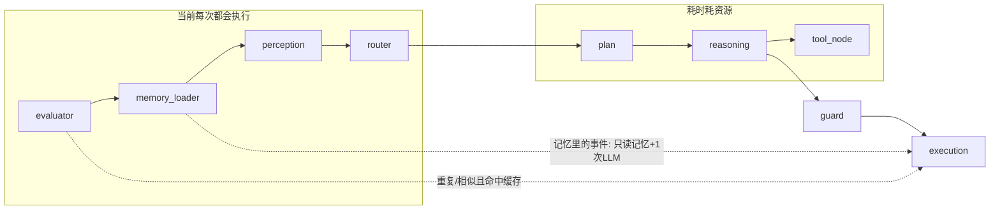

# 相似/重复问题节约资源 — 详细方案（含采访结论）

## 文档说明

- **目标**：在「不 build」的前提下，把「相似和重复问题如何节约资源、流程图如何拆解、共性问题如何抽取与汇总」想细，便于后续评审与实现。
- **依据**：基于与产品/负责人的采访结论整理，并细化决策逻辑、边界与产品向交付物。

---

## 一、采访结论汇总

| 维度 | 结论 | 对方案的影响 |
|------|------|--------------|
| **关心场景** | 跨会话重复（不同天/不同会话里重复问）+ **存在记忆里的事件** | 优化重点放在「跨会话」与「记忆事件类」；同一会话内连续重复可顺带覆盖 |
| **节约重点** | 整体平衡（LLM、检索、工具都希望省） | 不做单一极端优化，设计时要同时考虑少调用 LLM、少检索、少跑工具 |
| **答案复用** | 看场景：问候/时间可复用；天气等有时效的必须重算 | 必须区分「可复用」与「有时效」两类，缓存/短路策略按类型分支 |
| **记忆里的事件** | 先读记忆，再让 LLM 用记忆内容组织话术（省工具、不省 LLM） | 记忆事件类：不重复查工具/外部 API，但保留一次 LLM 把「记忆内容」组织成自然话术 |
| **流程图受众** | 产品 | 文档以产品可读为主：一页 Mermaid 总览 + 简短说明（哪里可省、省什么） |
| **共性问题数据** | 人工种子 + 日志/episodes 自动扩充（hybrid） | FAQ/标准答法：先人工维护一小批，再通过日志与情景记忆自动扩充 |

---

## 二、场景与分类（细化）

### 2.1 问题类型矩阵

| 类型 | 示例 | 是否可复用答案 | 省什么 | 备注 |
|------|------|----------------|--------|------|
| **问候/寒暄** | 「你好」「在吗」 | 可复用或轻量模板 | LLM + 检索 | 可走缓存或 Fast 模型 |
| **当前时间** | 「几点了」「现在几点」 | 可复用「话术结构」，数值需更新 | 工具可缓存短时（如 1 分钟），LLM 可省 | 若严格每分更新则只省检索 |
| **记忆内事实** | 「我发薪日几号」「我上次说喜欢什么颜色」 | 不可直接复读；**先读记忆，再 LLM 组织话术** | 省工具、省重复检索同一记忆 | 不省 LLM，省的是「不再查工具/不再重复捞同一记忆」 |
| **有时效信息** | 「今天天气」「明天天气」 | 不可复用，必须重算 | 不省工具；可省「同一问句的重复检索」 | 缓存只适用于「同一会话内极短时间重复」或不做缓存 |
| **通用追问** | 「然后呢」「怎么办」 | 依赖上下文，一般不直接复用 | 可省重复检索历史 | 主要靠上下文压缩与检索去重 |

### 2.2 「存在记忆里的事件」专门约定

- **定义**：用户问的是已经写入记忆的事实（如发薪日、偏好、过往对话中交代过的事件）。
- **期望行为**：
  1. **先读记忆**：从 RAM/ROM 中取出对应事实，不再调用外部工具。
  2. **再 LLM 组织话术**：用一次 LLM，输入 = 记忆内容 + 当前问句 + 必要上下文，输出 = 自然语言回复（省工具不省 LLM）。
- **节约点**：避免对「已知事实」再调天气/日历等工具；避免对同一记忆键的重复向量检索（可短时缓存「问句→记忆片段」）。

### 2.3 边界与例外

- **多轮指代**：「查一下」「那个呢」—— 必须结合对话历史做 query_rewrite，不能当作「与上句相同」做简单复用。
- **纠正/更新**：「不对，我发薪日是 15 号」—— 走正常更新流程，不命中「重复问题」优化。
- **亲密度/情绪相关**：同一句「你好」在不同亲密度下可期望不同语气——若做缓存，要么按「亲密度档位」分桶，要么只对极简问候做缓存并接受轻微差异。

---

## 三、节约资源的具体策略（按类型）

### 3.1 策略总表

| 策略 | 适用类型 | 省 LLM | 省检索 | 省工具 | 实现要点 |
|------|----------|--------|--------|--------|----------|
| **响应缓存（完全复用）** | 问候、极简确认 | 是 | 是 | 是 | Key=规范化问句或 embedding，TTL 短；仅无时效且无上下文敏感时用 |
| **时效敏感缓存** | 时间（可接受 1 分钟内一致） | 可选 | 是 | 是（短 TTL） | 时间类可缓存 1 分钟，话术模板 + 当前时间注入 |
| **记忆事件路径** | 记忆里的事件 | 否 | 部分（同一记忆键缓存） | 是 | 先读记忆 → 只调一次 LLM 组织话术，不调工具 |
| **FAQ/标准答法** | 共性问题（人工+自动） | 可省或减负 | 可省 | 视 FAQ 内容 | 命中则直接答或作强 few-shot，减少生成长度 |
| **轻量模型路由** | 简单重复、问候 | 是（用 Fast） | 是 | 是 | 识别为「简单重复」时走 Fast 而非 Reasoning |

### 3.2 决策树（是否走「节约路径」）

```
用户输入
  │
  ├─ 是否在「可完全复用」名单？（如：纯问候、且无亲密度敏感）
  │     └─ 是 → 查响应缓存 → 命中则直连 execution，不跑 LLM/检索/工具
  │
  ├─ 是否「记忆里的事件」？（意图识别：问发薪日/偏好/过往说过的事）
  │     └─ 是 → 读记忆（可带问句→记忆缓存）→ 只调 LLM 组织话术，不调工具
  │
  ├─ 是否有时效？（天气、新闻、时间且要求实时）
  │     └─ 是 → 不复用答案；可做「问句→检索结果」短缓存，省重复检索
  │
  └─ 否则 → 走常规链路；可选「相似问句」检 FAQ，命中则注入标准答法作 few-shot
```

### 3.3 平衡「整体都省」的落地顺序建议

1. **先做「记忆事件」路径**：明确省工具 + 减少重复检索，LLM 保留一次，产品价值清晰。
2. **再做「可复用」响应缓存**：限定在问候/极简句，避免误伤上下文敏感场景。
3. **然后 FAQ + 标准答法**：人工种子 + 自动扩充，用于减少重复推理与统一话术。
4. **最后做「相似问句→轻量模型」**：在未命中缓存与 FAQ 时，若判定为简单重复则走 Fast。

---

## 四、流程图拆解（产品向）

### 4.1 文档定位

- **受众**：产品（与需求方）。
- **形态**：**一页 Mermaid 总览 + 简短说明**（哪里可省、省什么），不展开技术实现细节。

### 4.2 总览图要素（建议包含）

- **当前主流程**：evaluator → memory_loader → perception → router → 三路（reflex / plan+reasoning / direct_output）→ guard → execution。
- **拟增「节约路径」**（用虚线或不同颜色标出）：
  - **路径 A**：evaluator 后 → 「重复/相似判断」→ 若命中缓存 → 直接到 execution（省整段中间链路）。
  - **路径 B**：memory_loader 后 → 若识别为「记忆里的事件」→ 读记忆 → 只走一次「组织话术」的 LLM → execution（省工具、省重复检索）。
- **图注**：用 1–2 句说明「实线=当前流程，虚线=优化后可省掉的调用（LLM/检索/工具）」。

### 4.3 简短说明（一段话模板，便于贴到产品文档）

- 「当前每次用户说话都会走完整链路：加载记忆、感知、路由、规划、推理（可能多次工具调用）、执行。优化后：**重复或相似问题**可以先判断是否命中缓存或是否属于**记忆里的事件**；命中缓存则直接给出上次回答（仅限问候等无时效场景），属于记忆事件则只从记忆里取内容再让 AI 组织一次话术（不再查天气等工具）。这样能**省掉重复的 LLM 调用、检索和工具调用**，同时保证有时效的问题（如天气）仍会重新查询。」

### 4.4 Mermaid 示例（产品一页用）



图注：实线=现有流程；虚线=优化后可走的短路（省中间 LLM/检索/工具）。

---

## 五、共性问题抽取与汇总答案（细化）

### 5.1 目标

- 从历史中归纳「共性问题」与「推荐答法」，在线优先使用或注入，减少重复推理与话术不一致。
- 数据来源：**人工种子 + 日志/episodes 自动扩充**（hybrid）。

### 5.2 人工种子阶段

- **内容**：先维护一小批「常见问句 → 标准答法」或「意图 → 标准答法」。
- **形式**：表结构建议至少包含：意图 ID、示例问句（1–3 条）、标准答法（一段话或模板）、是否可复用（是/否）、备注（如「仅问候」「时间需注入当前值」）。
- **用途**：上线前即可用于「完全复用」或「强 few-shot」；并作为自动扩充的种子。

### 5.3 自动扩充（日志 + episodes）

- **输入**：对话日志 (user_input, assistant_response)、episodes（情景记忆）。
- **步骤**：
  1. **意图/聚类**：对 user_input 做 embedding 聚类或规则意图分类，得到若干意图簇。
  2. **汇总答法**：同一簇内对 assistant_response 做归纳（规则：如选最长/最规范的一条；或 LLM 归纳一句「标准答法」）。
  3. **写入 FAQ/标准答法库**：存储为 (intent_or_cluster_id, canonical_question, canonical_answer, source=manual|auto)。
- **去重与合并**：新归纳出的条目与人工种子做相似度比对，避免重复；可设定「人工优先」覆盖策略。

### 5.4 在线使用方式

- **时机**：在 memory_loader 之后（或与「重复/相似判断」节点合并）。
- **逻辑**：用当前 user_input（或 query_rewrite 结果）查 FAQ/标准答法库；若相似度高于阈值：
  - **可复用**的意图：直接返回标准答法（或带轻量模板注入），走 execution。
  - **需 LLM 组织话术**的（如记忆事件）：将标准答法或记忆内容作为强 few-shot 注入，只调一次 LLM，不调工具。

### 5.5 与「记忆里的事件」的配合

- 记忆事件类问题**不强制**进 FAQ；优先走「读记忆 → LLM 组织话术」路径。
- 若某类记忆事件被多次问及（如「发薪日」），可离线归纳进 FAQ，在线先查 FAQ 再读记忆，用 FAQ 答法作模板减少 LLM 发挥空间，保证话术一致。

---

## 六、实施时注意事项（不 build，仅规划）

- **响应缓存**：必须限制在「无时效、低上下文敏感」的少数类型，并设 TTL 与 max_size，避免长期复读错误或过时话术。
- **记忆事件路径**：需在 router 或 perception 侧增加「是否在问记忆里已有的事实」的判定（规则或小模型），以决定是否走「只读记忆 + 一次 LLM」。
- **产品文档**：流程图一页 Mermaid + 一段话说明即可交付产品；技术细节（key 设计、阈值、节点入参出参）另放技术设计或 ADR。
- **FAQ 质量**：自动扩充的条目建议有人工审核或置信度过滤，避免把错误或一次性回复归纳成标准答法。

---

## 七、小结

- **场景**：重点服务跨会话重复 + 记忆里的事件；答案复用按场景分（可复用 vs 有时效）；记忆事件采用「先读记忆再 LLM 组织话术」。
- **节约**：整体平衡 LLM/检索/工具；通过响应缓存、记忆事件路径、FAQ/标准答法、轻量模型路由分层实现。
- **流程图**：产品向一页 Mermaid 总览 + 简短说明，标出「哪里可省、省什么」。
- **共性问题**：人工种子 + 日志/episodes 自动扩充；在线命中则直接答或作 few-shot，与记忆事件路径配合使用。

本文档仅作方案与规划细化，不涉及具体代码实现或 build。
