# Project Animus 详细架构设计文档 v2.0

## 文档信息

| 项目 | 内容 |
|:---|:---|
| **项目名称** | Project Animus - 详细架构设计 |
| **文档版本** | v2.0 |
| **创建日期** | 2025-01-XX |
| **设计原则** | 两层架构（逻辑判断层 + LLM推理层） |
| **目标** | 每个节点、每个流程都设计得清清楚楚 |

---

## 一、架构总览

### 1.1 两层架构定义

```
┌─────────────────────────────────────────────────────────────┐
│  第一层：逻辑判断层 (Fast Logic Layer)                      │
│  ┌──────────────┐  ┌──────────────┐  ┌──────────────┐      │
│  │ evaluator    │→ │memory_loader │→ │ perception   │      │
│  │ (评估器)      │  │ (记忆加载)    │  │ (感知节点)    │      │
│  └──────────────┘  └──────────────┘  └──────────────┘      │
│         │                  │                  │             │
│         └──────────────────┴──────────────────┘             │
│                            │                                │
│                            ▼                                │
│                   ┌──────────────┐                          │
│                   │   router     │                          │
│                   │ (路由决策)    │                          │
│                   └──────────────┘                          │
│                            │                                │
│         ┌──────────────────┼────────────────────────┐       │
│         │                  │                        │       │
│    reflex          local_email_node          reasoning      │
│    (快速反射)       (本地邮件处理)            (推理路径)      │
└─────────────────────────────────────────────────────────────┘
                            │
                            ▼
┌─────────────────────────────────────────────────────────────┐
│  第二层：LLM推理层 (LLM Reasoning Layer)                      │
│  ┌──────────────┐  ┌──────────────┐  ┌──────────────┐      │
│  │    plan      │→ │  reasoning   │→ │    tool      │      │
│  │  (规划节点)   │  │  (推理节点)   │  │  (工具节点)   │      │
│  └──────────────┘  └──────────────┘  └──────────────┘      │
│         ▲                  │                  │             │
│         │                  │                  │             │
│         └──────────────────┴──────────────────┘             │
│                      (工具调用循环)                          │
│                            │                                │
│                            ▼                                │
│  ┌──────────────┐  ┌──────────────┐  ┌──────────────┐      │
│  │   critique   │→ │    guard     │→ │  execution    │      │
│  │  (反思节点)   │  │  (安全卫士)   │  │  (执行节点)   │      │
│  └──────────────┘  └──────────────┘  └──────────────┘      │
└─────────────────────────────────────────────────────────────┘
```

### 1.2 架构原则

1. **职责分离**：第一层做快速判断，第二层做深度推理
2. **性能优先**：简单任务不走LLM，降低延迟和成本
3. **可扩展性**：两层独立，易于添加新功能
4. **可观测性**：每个节点都有明确的输入输出和状态
5. **错误处理**：每个节点都有明确的错误处理策略

---

## 二、第一层：逻辑判断层 - 详细设计

### 2.1 evaluator_node（评估器）

#### 2.1.1 节点职责

判断当前事件是否需要继续处理，过滤掉不应该处理的事件（如专注模式下的主动行为）。

#### 2.1.2 输入数据结构

```python
{
    # 事件信息
    "event_type": str,              # "user_input" | "sensor" | "timer" | 
                                    # "internal_drive" | "email_notification" | 
                                    # "schedule_reminder"
    
    # 用户输入（如果是用户输入事件）
    "user_input": Optional[str],
    
    # 传感器数据（如果是传感器事件）
    "sensor_data": Dict[str, Any],  # {"touch": bool, "shake": bool, ...}
    
    # 内部状态
    "internal_drives": Dict[str, Any],  # {"boredom": float, "energy": int, ...}
    "focus_mode": bool,                 # 是否开启专注模式
    "conflict_state": Optional[Dict],   # 冲突状态（如果有）
    
    # 用户偏好
    "user_preferences": Dict[str, Any],  # 勿扰时间等设置
}
```

#### 2.1.3 输出数据结构

```python
{
    "should_proceed": bool,         # 是否继续处理
    "evaluation_reason": str,       # 评估原因（用于调试）
    "proactive_expression": Optional[str],  # 主动表达内容（如果有）
    "monologue": Optional[str],     # 内部独白（用于展示思考过程）
    
    # 特殊事件可能需要修改事件类型
    "event_type": Optional[str],    # 可能被修改的事件类型
    "user_input": Optional[str],    # 可能被修改的用户输入（如邮箱通知）
}
```

#### 2.1.4 详细决策树

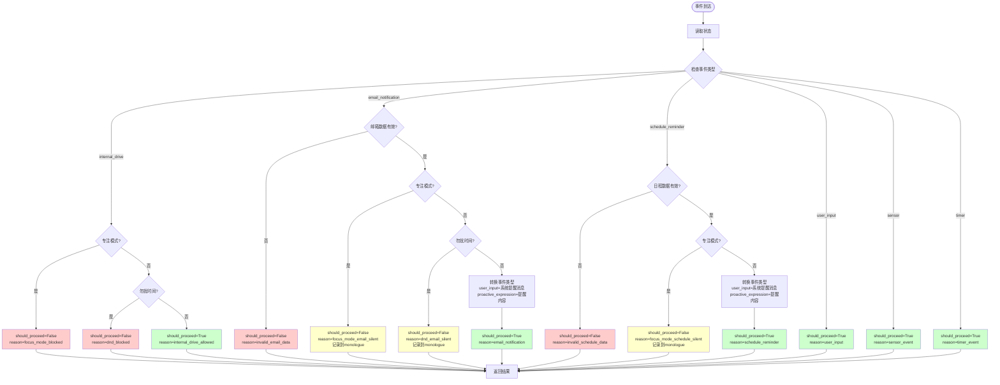

#### 2.1.5 边界情况处理

| 情况 | 处理方式 |
|:---|:---|
| `event_type` 为 `None` | 返回 `should_proceed=False`, `reason="unknown_event_type"` |
| `focus_mode` 状态未知 | 默认 `focus_mode=False`，允许处理 |
| 勿扰时间判断失败 | 默认不在勿扰时间，允许处理 |
| 邮箱数据格式错误 | 返回 `should_proceed=False`, `reason="invalid_email_data"` |
| 日程数据缺失 | 返回 `should_proceed=False`, `reason="invalid_schedule_data"` |

#### 2.1.6 错误处理

```python
try:
    # 主要逻辑
    result = evaluate_event(state)
    return result
except Exception as e:
    # 错误处理：默认允许处理，但记录错误
    print(f"⚠️ Evaluator错误: {e}")
    return {
        "should_proceed": True,  # 默认允许，避免阻塞
        "evaluation_reason": f"error: {str(e)}"
    }
```

---

### 2.2 memory_loader_node（记忆加载器）

#### 2.2.1 节点职责

从向量数据库检索相关记忆和动作模式，为后续节点提供上下文。

#### 2.2.2 输入数据结构

```python
{
    "user_input": Optional[str],        # 用户输入（用于Query Rewrite）
    "history": List[Dict],               # 对话历史（用于Query Rewrite）
    "user_profile": Dict[str, Any],      # 用户画像（RAM，结构化数据）
}
```

#### 2.2.3 输出数据结构

```python
{
    "memory_context": {
        "user_profile": str,             # 用户画像文本（格式化后）
        "user_memories": List[str],       # 相关用户记忆（ROM，k=3）
        "action_patterns": List[str]      # 相关动作模式（k=2）
    }
}
```

#### 2.2.4 详细处理流程

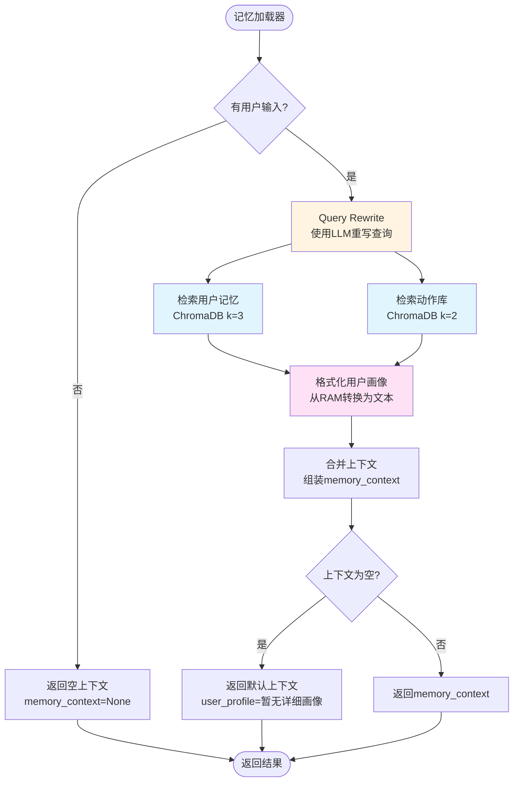

#### 2.2.5 Query Rewrite 详细逻辑

```python
def query_rewrite(user_input: str, history: List[Dict]) -> str:
    """
    Query Rewrite：使用LLM重写查询，考虑对话历史中的指代
    
    示例：
    用户输入："查一下"
    对话历史：[{"user": "北京天气怎么样？", "assistant": "..."}, {"user": "查一下"}]
    重写后："北京天气怎么样？"
    """
    # 1. 检查是否有指代词（"查一下"、"那个"、"这个"等）
    # 2. 如果有，从对话历史中提取上下文
    # 3. 调用LLM重写查询
    # 4. 返回重写后的查询
```

#### 2.2.6 边界情况处理

| 情况 | 处理方式 |
|:---|:---|
| `user_input` 为空 | 返回空上下文，`memory_context=None` |
| Query Rewrite 失败 | 使用原始 `user_input` 进行检索 |
| ChromaDB 连接失败 | 返回空上下文，记录错误但不阻塞 |
| 检索结果为空 | 返回默认上下文，`user_profile="暂无详细画像"` |
| `user_profile` 为空 | 使用默认值 `"暂无详细画像"` |

---

### 2.3 perception_node（感知节点）

#### 2.3.1 节点职责

感知内部状态，生成上下文信号，为路由和推理节点提供状态信息。

#### 2.3.2 输入数据结构

```python
{
    "internal_drives": Dict[str, Any],   # {"boredom": 0.8, "energy": 60, ...}
    "energy_level": int,                 # 0-100
    "intimacy_level": float,             # 0-100
    "focus_mode": bool,
    "conflict_state": Optional[Dict],    # {"offense_level": "L1", "cooldown_until": 1234567890}
    "current_hardware_state": Dict,      # 当前硬件状态
}
```

#### 2.3.3 输出数据结构

```python
{
    "context_signals": {
        "time_of_day": str,              # "morning" | "afternoon" | "evening" | "night"
        "energy_status": str,             # "high" | "medium" | "low"
        "intimacy_rank": str,             # "stranger" | "acquaintance" | "friend" | "soulmate"
        "focus_mode": bool,
        "conflict_cooldown": bool,        # 是否在冲突冷却期
        "boredom_level": float,           # 0.0-1.0
    }
}
```

#### 2.3.4 详细处理流程

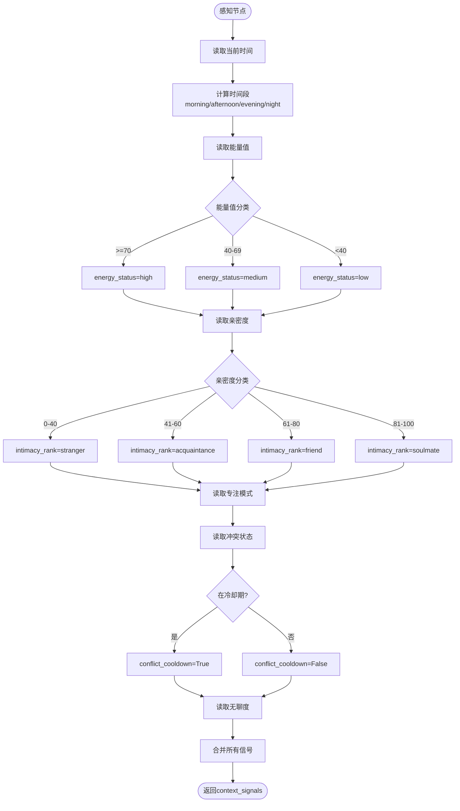

#### 2.3.5 时间段判断逻辑

```python
def get_time_of_day() -> str:
    """根据当前时间判断时间段"""
    hour = datetime.now().hour
    if 5 <= hour < 12:
        return "morning"
    elif 12 <= hour < 18:
        return "afternoon"
    elif 18 <= hour < 22:
        return "evening"
    else:
        return "night"
```

#### 2.3.6 边界情况处理

| 情况 | 处理方式 |
|:---|:---|
| `energy_level` 为 `None` | 默认 `energy_level=50`, `energy_status="medium"` |
| `intimacy_level` 为 `None` | 默认 `intimacy_level=30.0`, `intimacy_rank="stranger"` |
| `focus_mode` 为 `None` | 默认 `focus_mode=False` |
| `conflict_state` 为 `None` | `conflict_cooldown=False` |
| 时间获取失败 | 默认 `time_of_day="afternoon"` |

---

### 2.4 router_node（路由节点）

#### 2.4.1 节点职责

根据用户输入和上下文，决定走哪个处理路径（reflex/reasoning/direct_output/ignore）。

#### 2.4.2 输入数据结构

```python
{
    "user_input": Optional[str],
    "sensor_data": Dict[str, Any],
    "memory_context": Optional[Dict],
    "proactive_expression": Optional[str],
    "context_signals": Dict[str, Any],
    "command_type": Optional[str],       # 从reflex_router预处理的命令类型
}
```

#### 2.4.3 输出数据结构

```python
{
    "intent_route": str,                 # "reflex" | "reasoning" | "direct_output" | "ignore"
    "monologue": Optional[str],          # 路由理由
}
```

#### 2.4.4 详细决策树

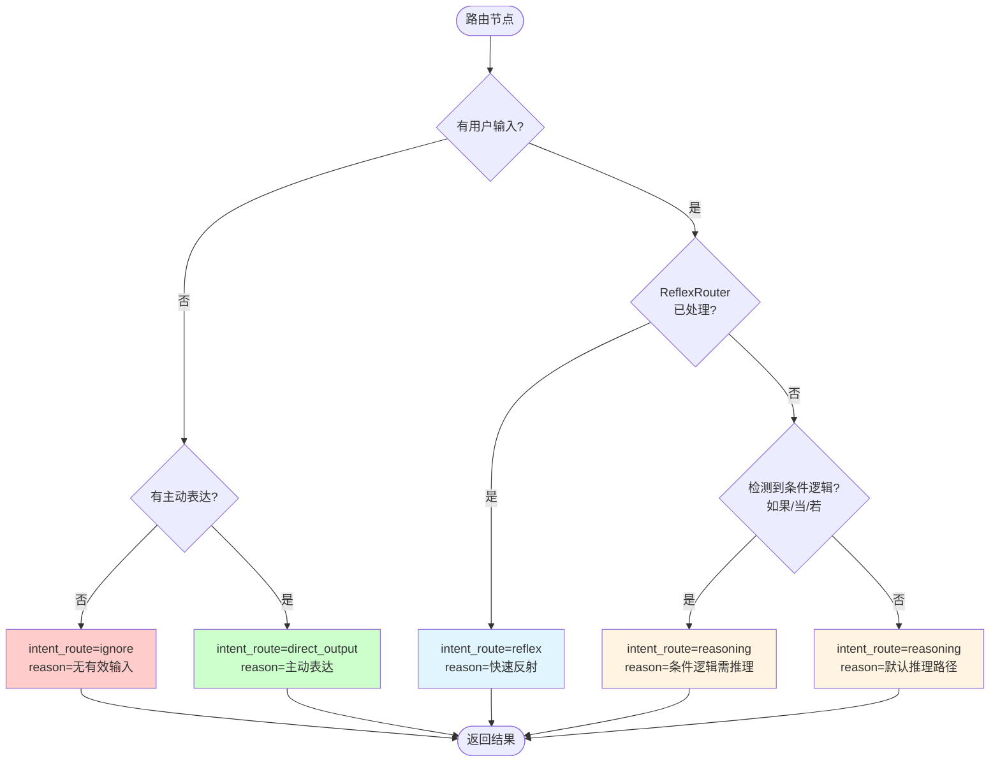

#### 2.4.5 ReflexRouter 集成

`router_node` 会先检查 `reflex_router` 是否已经处理了该输入：

```python
from .reflex_router import ReflexRouter

reflex_router = ReflexRouter()
command_type = reflex_router.route(user_input, sensor_data)

if command_type in ["greeting", "light_control", "sensor_reaction", "stop"]:
    return {"intent_route": "reflex"}
```

#### 2.4.6 条件逻辑检测

```python
CONDITIONAL_KEYWORDS = ["如果", "当", "若", "要是", "if", "when", "while"]

def has_conditional_logic(user_input: str) -> bool:
    """检测用户输入中是否包含条件逻辑"""
    input_lower = user_input.lower()
    return any(kw in input_lower for kw in CONDITIONAL_KEYWORDS)
```

#### 2.4.7 边界情况处理

| 情况 | 处理方式 |
|:---|:---|
| `user_input` 为空且无 `proactive_expression` | 返回 `intent_route="ignore"` |
| `user_input` 只有空白字符 | 视为空输入，返回 `intent_route="ignore"` |
| ReflexRouter 处理失败 | 默认走 `reasoning` 路径 |
| 条件检测失败 | 默认走 `reasoning` 路径 |

---

### 2.5 reflex_node（反射节点）

#### 2.5.1 节点职责

快速响应简单、明确的指令，无需LLM调用。

#### 2.5.2 输入数据结构

```python
{
    "user_input": str,
    "sensor_data": Dict[str, Any],
    "command_type": str,                 # "greeting" | "light_control" | 
                                         # "sensor_reaction" | "stop" | ...
}
```

#### 2.5.3 输出数据结构

```python
{
    "action_plan": Dict[str, Any],       # 硬件控制计划
    "voice_content": str,                # 语音内容
    "execution_status": str,              # "completed"
    "intimacy_delta": Optional[float],   # 亲密度变化（如果有）
    "intimacy_reason": Optional[str],    # 变化原因
}
```

#### 2.5.4 详细处理流程

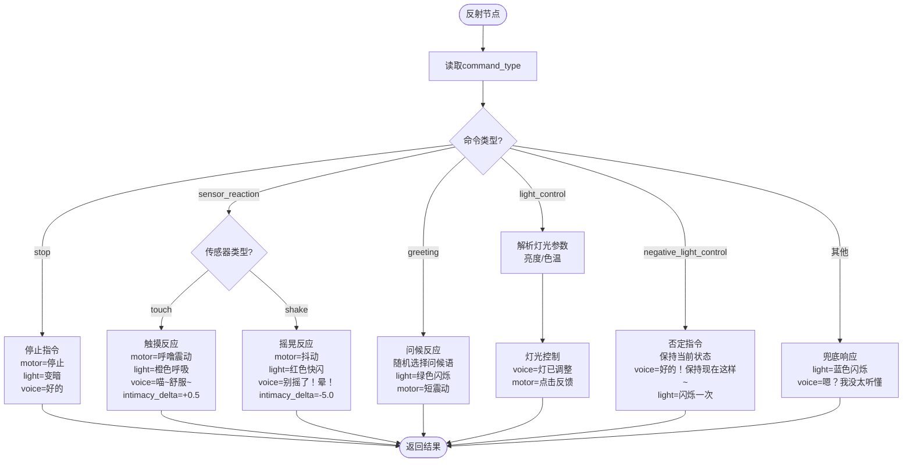

#### 2.5.5 灯光控制参数解析

```python
def parse_light_control(user_input: str) -> Dict[str, Any]:
    """
    解析灯光控制参数
    
    支持的指令：
    - "开灯" → brightness=100
    - "关灯" → brightness=0
    - "调亮" / "变亮" → brightness=100
    - "调暗" / "变暗" → brightness=30
    - "亮度50" → brightness=50
    - "暖光" → color_temp="warm"
    - "冷光" → color_temp="cool"
    """
    # 实现细节...
```

#### 2.5.6 边界情况处理

| 情况 | 处理方式 |
|:---|:---|
| `command_type` 未知 | 返回兜底响应，`voice_content="嗯？我没太听懂"` |
| 传感器数据缺失 | 如果是 `sensor_reaction`，返回空响应 |
| 灯光参数解析失败 | 使用默认值 `brightness=80, color_temp="warm"` |
| 问候语列表为空 | 使用默认问候语 `"我在呢！"` |

---

### 2.6 local_email_node（本地邮件处理节点）

#### 2.6.1 节点职责

利用本地 LLM (Ollama) 对邮件内容进行隐私优先的处理，包括情感识别、任务提取、重要性打分和脱敏总结。

#### 2.6.2 输入数据结构

```python
{
    "event_type": "email_notification",
    "email_data": {
        "uid": str,
        "sender": str,
        "subject": str,
        "body": str,            # 原始邮件正文（仅本地可见）
    },
    "current_user_status": str,  # "Owner" | "Guest" | "Unknown"
    "history": List[Dict],       # 最近对话历史（用于动态权重）
}
```

#### 2.6.3 输出数据结构

```python
{
    "email_assistant_data": {
        "importance_score": int,    # 0-100
        "sentiment": str,           # "happy" | "anxious" | ...
        "summary": str,             # 脱敏后的猫系摘要
        "has_task": bool,
        "is_sensitive": bool,
    },
    "intent_route": "reasoning",    # 处理完后交由推理节点生成最终语音
    "user_input": str,              # 注入给推理节点的系统指令
}
```

#### 2.6.4 详细处理流程

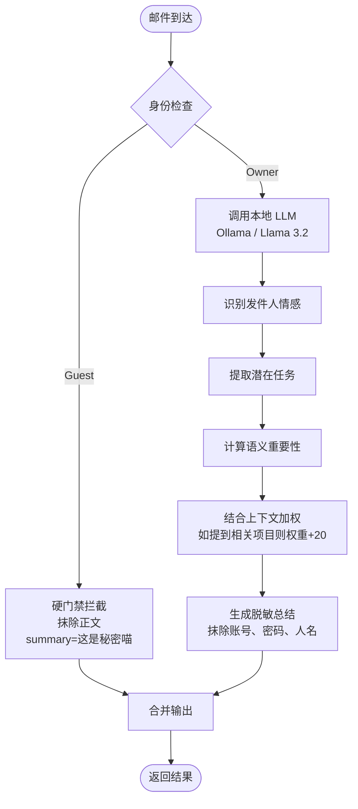

#### 2.6.5 隐私防御逻辑

1.  **硬门禁（逻辑层）**：代码判断 `user_status != 'Owner'` 时，直接返回预设拒绝文本，不调用 LLM 处理正文。
2.  **软拒绝（模型层）**：Prompt 中包含“如果是访客询问，请礼貌地保守秘密”的指令。
3.  **脱敏规范**：本地模型在生成 `summary` 时，必须执行以下正则替换：
    *   数字/验证码 -> `[数字]`
    *   银行卡/账号 -> `[账号]`
    *   详细地址 -> `[地点]`

#### 2.6.6 边界情况处理

| 情况 | 处理方式 |
| :--- | :--- |
| Ollama 服务不可用 | 降级为规则处理（仅处理发件人和标题），summary 设置为“收到邮件但我的大脑卡住了喵” |
| 邮件正文过长 | 截断前 2000 字符进行处理 |
| 身份识别失败 | 默认视为 `Unknown`，执行硬门禁拦截 |

---

## 三、第二层：LLM推理层 - 详细设计

### 3.1 plan_node（规划节点）

#### 3.1.1 节点职责

分析任务复杂度，制定执行计划，管理多步骤任务的执行进度。

#### 3.1.2 输入数据结构

```python
{
    # 首次规划输入
    "user_input": str,
    "memory_context": Optional[Dict],
    "history": List[Dict],
    
    # 工具调用循环返回时
    "tool_results": Optional[List[Dict]],    # 工具执行结果
    "execution_plan": Optional[Dict],         # 当前执行计划
    "current_step_index": int,                # 当前步骤索引
}
```

#### 3.1.3 输出数据结构

```python
{
    "execution_plan": {
        "plan_id": str,                       # 计划唯一标识
        "created_at": float,                  # 创建时间戳
        "complexity": str,                    # "simple" | "moderate" | "complex"
        "steps": List[Dict],                  # 执行步骤列表
        "current_step": int,                  # 当前执行步骤索引
        "total_steps": int,                   # 总步骤数
        "required_tools": List[str],          # 需要的工具列表
        "estimated_time": float,              # 预估执行时间（秒）
    },
    "plan_status": str,                       # "created" | "skipped" | "executing" | "completed" | "failed"
    "current_step_index": int,
    "tool_calls": List[Dict],                # 当前步骤的工具调用
    "monologue": str,                         # 规划过程的内心独白
}
```

#### 3.1.4 详细处理流程

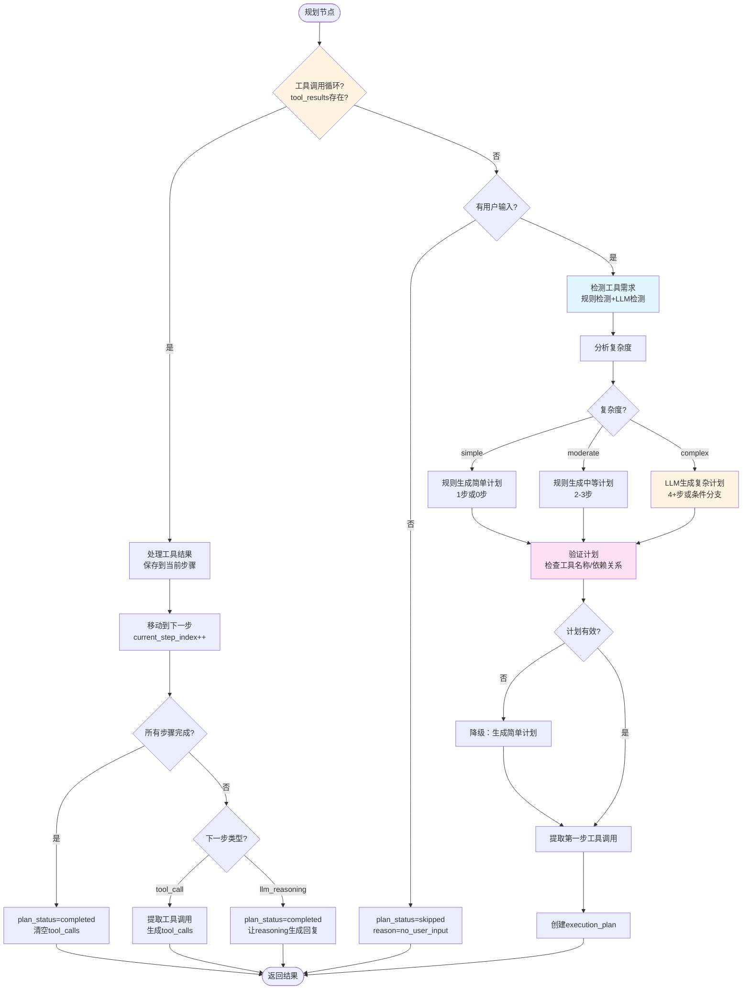

#### 3.1.5 工具需求检测

**规则检测（快速路径）**：

```python
TOOL_KEYWORDS = {
    "weather_tool": ["天气", "温度", "下雨", "晴天"],
    "time_tool": ["时间", "几点", "现在"],
    "music_tool": ["音乐", "歌", "播放"],
    "news_tool": ["新闻", "资讯"],
    # ...
}

def rule_based_tool_detection(user_input: str) -> List[str]:
    """基于关键词快速检测工具需求"""
    detected_tools = []
    for tool_name, keywords in TOOL_KEYWORDS.items():
        if any(kw in user_input for kw in keywords):
            detected_tools.append(tool_name)
    return detected_tools
```

**LLM检测（复杂场景）**：

```python
def llm_based_tool_detection(user_input: str, history: List[Dict]) -> List[str]:
    """使用LLM检测工具需求（用于复杂场景）"""
    # 调用LLM分析用户意图
    # 返回需要的工具列表
```

#### 3.1.6 复杂度分析

```python
def analyze_complexity(user_input: str, memory_context: Dict) -> str:
    """
    分析任务复杂度
    
    判断标准：
    - simple: 无工具需求，或单一明确工具
    - moderate: 1-2个工具，无条件分支
    - complex: 3+工具，或包含条件逻辑
    """
    # 1. 检测工具数量
    tool_count = len(detected_tools)
    
    # 2. 检测条件逻辑
    has_conditional = has_conditional_logic(user_input)
    
    # 3. 判断复杂度
    if tool_count == 0:
        return "simple"
    elif tool_count == 1 and not has_conditional:
        return "moderate"
    else:
        return "complex"
```

#### 3.1.7 计划生成

**简单计划（规则生成）**：

```python
def generate_simple_plan(user_input: str, required_tools: List[str]) -> Dict:
    """规则生成简单计划"""
    steps = []
    
    # 如果有工具，添加工具调用步骤
    for tool_name in required_tools:
        steps.append({
            "step_id": len(steps) + 1,
            "description": f"调用{tool_name}",
            "action_type": "tool_call",
            "tool_name": tool_name,
            "tool_args": extract_tool_args(user_input, tool_name),
            "expected_output": f"{tool_name}的执行结果",
            "depends_on": []
        })
    
    # 添加LLM推理步骤
    steps.append({
        "step_id": len(steps) + 1,
        "description": "生成回复",
        "action_type": "llm_reasoning",
        "expected_output": "语音内容和动作计划",
        "depends_on": list(range(1, len(steps)))  # 依赖所有工具步骤
    })
    
    return {
        "plan_id": generate_plan_id(),
        "created_at": time.time(),
        "complexity": "simple",
        "steps": steps,
        "total_steps": len(steps),
        "required_tools": required_tools
    }
```

**复杂计划（LLM生成）**：

```python
def generate_complex_plan_with_llm(user_input: str, context: Dict) -> Dict:
    """使用LLM生成复杂计划"""
    # 构建Prompt
    prompt = f"""
    分析以下用户请求，生成详细的执行计划。
    
    用户输入：{user_input}
    可用工具：{get_tool_descriptions()}
    对话历史：{format_history(context['history'])}
    
    请生成JSON格式的执行计划...
    """
    
    # 调用LLM
    plan_json = llm.invoke(prompt)
    
    # 解析和验证
    plan = json.loads(plan_json)
    validate_plan(plan)
    
    return plan
```

#### 3.1.8 工具调用循环处理

```python
def handle_tool_result(state: LampState, existing_plan: Dict, tool_results: List[Dict]) -> Dict:
    """处理工具调用循环返回的结果"""
    current_step_index = state.get("current_step_index", 0)
    steps = existing_plan.get("steps", [])
    
    # 1. 保存工具结果到当前步骤
    if current_step_index < len(steps):
        steps[current_step_index]["result"] = tool_results[-1] if tool_results else None
    
    # 2. 移动到下一步
    next_step_index = current_step_index + 1
    
    # 3. 检查是否完成
    if next_step_index >= len(steps):
        return {
            "execution_plan": existing_plan,
            "plan_status": "completed",
            "current_step_index": next_step_index,
            "tool_calls": []
        }
    
    # 4. 提取下一步的工具调用
    next_step = steps[next_step_index]
    if next_step.get("action_type") == "tool_call":
        tool_call = convert_step_to_tool_call(next_step)
        return {
            "execution_plan": existing_plan,
            "plan_status": "executing",
            "current_step_index": next_step_index,
            "tool_calls": [tool_call]
        }
    else:
        # 下一步是llm_reasoning，标记为完成
        return {
            "execution_plan": existing_plan,
            "plan_status": "completed",
            "current_step_index": next_step_index,
            "tool_calls": []
        }
```

#### 3.1.9 边界情况处理

| 情况 | 处理方式 |
|:---|:---|
| `user_input` 为空 | 返回 `plan_status="skipped"`, `reason="no_user_input"` |
| 工具检测失败 | 默认无工具需求，生成简单计划 |
| LLM生成计划失败 | 降级为规则生成简单计划 |
| 计划验证失败 | 使用降级计划，记录错误 |
| 工具调用循环中步骤索引越界 | 标记为完成，返回 `plan_status="completed"` |
| 工具结果格式错误 | 使用空结果，继续执行下一步 |

---

### 3.2 reasoning_node（推理节点）

#### 3.2.1 节点职责

使用LLM生成回复和动作计划，注入工具结果和上下文。

#### 3.2.2 输入数据结构

```python
{
    "user_input": str,
    "memory_context": Optional[Dict],
    "history": List[Dict],
    "execution_plan": Optional[Dict],
    "tool_results": Optional[List[Dict]],
    "intimacy_level": float,
    "conflict_state": Optional[Dict],
    "focus_mode": bool,
    "context_signals": Dict[str, Any],
}
```

#### 3.2.3 输出数据结构

```python
{
    "voice_content": str,                 # 语音内容
    "action_plan": Dict[str, Any],         # 硬件控制计划
    "intimacy_delta": float,               # 亲密度变化
    "intimacy_reason": str,                # 变化原因
    "tool_calls": Optional[List[Dict]],    # 如果需要调用工具（不应该发生，但防御性检查）
}
```

#### 3.2.4 详细处理流程

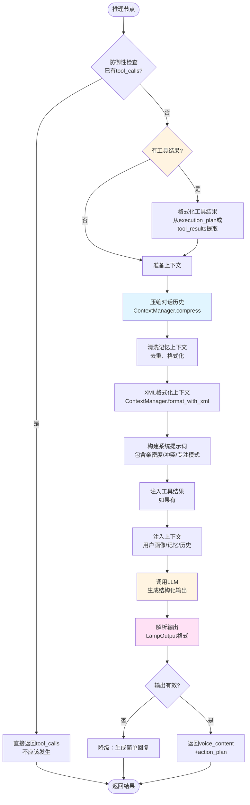

#### 3.2.5 工具结果提取

```python
def format_tool_results_for_prompt(execution_plan: Dict) -> str:
    """从执行计划中提取所有工具结果，格式化为Prompt文本"""
    steps = execution_plan.get("steps", [])
    results = []
    
    for step in steps:
        if step.get("action_type") == "tool_call":
            result = step.get("result")
            if result:
                tool_name = step.get("tool_name", "未知工具")
                output = result.get("output", result.get("error", "无输出"))
                results.append(f"{tool_name}的执行结果：{output}")
    
    return "\n\n".join(results)
```

#### 3.2.6 上下文压缩

```python
def compress_conversation_history(history: List[Dict]) -> Dict:
    """
    压缩对话历史
    
    策略：
    - 最近2轮：保持完整（hot data）
    - 3-10轮：压缩为摘要（warm data）
    - 20+轮：归档到向量数据库（cold data）
    """
    if len(history) <= 2:
        return {"compressed": False, "history": history}
    
    # 使用LLM压缩
    compression_result = context_manager.compress_conversation_history(history)
    
    return compression_result
```

#### 3.2.7 XML格式化上下文

```python
def format_context_with_xml(
    user_profile: str,
    recent_memories: List[str],
    action_patterns: List[str],
    conversation_history: str,
    current_state: Dict
) -> str:
    """使用XML标签格式化上下文，提高LLM注意力"""
    return f"""
<system_instructions>
你是一个陪伴型人工智能助手 Animus...
</system_instructions>

<context>
<user_profile>
{user_profile}
</user_profile>

<recent_memories>
{format_list(recent_memories)}
</recent_memories>

<action_patterns>
{format_list(action_patterns)}
</action_patterns>
</context>

<conversation_history>
{conversation_history}
</conversation_history>

<current_state>
亲密度等级：{current_state['intimacy_level']} ({current_state['intimacy_rank']})
专注模式：{'开启' if current_state['focus_mode'] else '关闭'}
冲突状态：{format_conflict_state(current_state.get('conflict_state'))}
</current_state>

<task>
用户输入：{user_input}
</task>
"""
```

#### 3.2.8 LLM调用

```python
def call_llm_for_reasoning(prompt: str, tool_results: Optional[str]) -> Dict:
    """调用LLM生成回复"""
    # 构建完整Prompt
    full_prompt = prompt
    if tool_results:
        full_prompt += f"\n\n<tool_results>\n{tool_results}\n</tool_results>"
    
    # 调用LLM
    response = llm.invoke(full_prompt)
    
    # 解析结构化输出
    output = parser.parse(response)
    
    return {
        "voice_content": output.voice_content,
        "action_plan": output.action_plan,
        "intimacy_delta": output.intimacy_delta,
        "intimacy_reason": output.intimacy_reason
    }
```

#### 3.2.9 边界情况处理

| 情况 | 处理方式 |
|:---|:---|
| `user_input` 为空 | 返回默认回复 `"我在呢！"` |
| 工具结果提取失败 | 继续执行，不使用工具结果 |
| 对话历史压缩失败 | 使用简单截断（最近5轮） |
| LLM调用失败 | 返回降级回复，记录错误 |
| 输出解析失败 | 使用默认值，记录错误 |
| 上下文过长 | 进一步压缩或截断 |

---

### 3.3 tool_node（工具节点）

#### 3.3.1 节点职责

执行工具调用（本地工具或MCP工具），返回执行结果。

#### 3.3.2 输入数据结构

```python
{
    "tool_calls": List[Dict],              # [{"name": "weather_tool", "args": {"city": "北京"}}]
}
```

#### 3.3.3 输出数据结构

```python
{
    "tool_results": List[Dict],            # [{"tool_call_id": "...", "output": "..."}]
}
```

#### 3.3.4 详细处理流程

```mermaid
flowchart TD
    Start([工具节点]) --> CheckCalls{有tool_calls?}
    
    CheckCalls -->|否| ReturnEmpty[返回空结果<br/>tool_results=[]]
    CheckCalls -->|是| IterateTools[遍历tool_calls]
    
    IterateTools --> CheckType{工具类型?}
    
    CheckType -->|MCP工具| CallMCP[调用MCP Manager<br/>异步执行]
    CheckType -->|本地工具| FindTool[查找工具函数<br/>从AVAILABLE_TOOLS]
    
    CallMCP --> ExecuteMCP[执行MCP工具]
    FindTool --> CheckFound{找到工具?}
    
    CheckFound -->|否| Error1[返回错误<br/>error=未找到工具]
    CheckFound -->|是| ExecuteLocal[执行本地工具]
    
    ExecuteMCP --> CheckSuccess{执行成功?}
    ExecuteLocal --> CheckSuccess2{执行成功?}
    
    CheckSuccess -->|是| FormatResult1[格式化结果<br/>output=执行结果]
    CheckSuccess -->|否| FormatError1[格式化错误<br/>error=错误信息]
    
    CheckSuccess2 -->|是| FormatResult2[格式化结果]
    CheckSuccess2 -->|否| FormatError2[格式化错误]
    
    FormatResult1 --> CheckProfile{更新Profile?<br/>update_profile_tool}
    FormatResult2 --> CheckProfile
    
    CheckProfile -->|是| MarkProfile[标记profile_updated=True]
    CheckProfile -->|否| CollectResult[收集结果]
    
    FormatError1 --> CollectResult
    FormatError2 --> CollectResult
    Error1 --> CollectResult
    MarkProfile --> CollectResult
    
    CollectResult --> CheckMore{还有工具?}
    CheckMore -->|是| IterateTools
    CheckMore -->|否| ReturnResults[返回tool_results]
    
    ReturnEmpty --> Return
    ReturnResults --> Return([返回结果])
    
    style CheckType fill:#fff4e1
    style ExecuteMCP fill:#e1f5ff
    style ExecuteLocal fill:#e1f5ff
    style CheckProfile fill:#ffe1f5
```

#### 3.3.5 MCP工具调用

```python
async def call_mcp_tool(tool_name: str, args: Dict) -> str:
    """调用MCP工具（异步）"""
    mcp_manager = get_mcp_manager()
    result = await mcp_manager.call_tool(tool_name, args)
    return str(result)
```

#### 3.3.6 本地工具调用

```python
def call_local_tool(tool_name: str, args: Dict) -> str:
    """调用本地工具"""
    # 查找工具函数
    tool_func = None
    for tool in AVAILABLE_TOOLS:
        if tool.name == tool_name:
            tool_func = tool
            break
    
    if not tool_func:
        raise ValueError(f"未找到工具: {tool_name}")
    
    # 执行工具
    result = tool_func.invoke(args)
    return str(result)
```

#### 3.3.7 Profile更新同步

```python
def handle_profile_update(tool_name: str, tool_result: Dict) -> bool:
    """检查工具调用是否更新了Profile"""
    if tool_name == "update_profile_tool":
        # Profile已更新，需要同步到State
        return True
    return False
```

#### 3.3.8 边界情况处理

| 情况 | 处理方式 |
|:---|:---|
| `tool_calls` 为空 | 返回空结果，不阻塞 |
| 工具名称不存在 | 返回错误结果，继续处理其他工具 |
| 工具参数错误 | 返回错误结果，记录详细错误信息 |
| MCP调用失败 | 返回错误结果，不阻塞其他工具 |
| 工具执行超时 | 返回超时错误，设置默认超时时间（5秒） |
| Profile更新失败 | 记录错误，但不影响工具结果返回 |

---

### 3.4 critique_node（反思节点）【待实现】

#### 3.4.1 节点职责

评估执行结果的质量，决定是否需要重新规划。

#### 3.4.2 输入数据结构

```python
{
    "voice_content": str,
    "action_plan": Dict[str, Any],
    "tool_results": Optional[List[Dict]],
    "user_input": str,
    "execution_plan": Optional[Dict],
}
```

#### 3.4.3 输出数据结构

```python
{
    "critique_result": {
        "quality_score": float,           # 0.0-1.0
        "issues": List[str],               # 问题列表
        "suggestions": List[str]           # 改进建议
    },
    "need_replan": bool,                   # 是否需要重新规划
    "replan_reason": Optional[str],        # 重新规划的原因
}
```

#### 3.4.4 详细处理流程

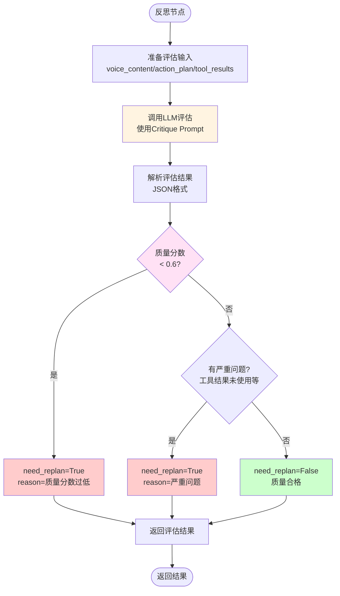

#### 3.4.5 评估标准

```python
EVALUATION_CRITERIA = {
    "relevance": "回复是否回答了用户问题",
    "tool_usage": "是否正确使用了工具结果",
    "action_reasonableness": "动作计划是否合理",
    "persona_consistency": "是否符合'温柔坚定'的人设",
    "completeness": "是否完整回答了用户问题",
}
```

#### 3.4.6 Critique Prompt

```python
CRITIQUE_PROMPT = """
你是一个质量评估专家。评估以下回复和动作计划的质量。

用户输入：{user_input}

生成的回复：{voice_content}

动作计划：{action_plan}

工具执行结果：{tool_results}

请从以下维度评估：
1. 回复相关性：是否回答了用户问题
2. 工具结果利用：是否正确使用了工具结果
3. 动作合理性：硬件动作是否合理
4. 人设一致性：是否符合"温柔坚定"的人设
5. 完整性：是否完整回答了用户问题

输出JSON格式：
{{
    "quality_score": 0.0-1.0,
    "issues": ["问题1", "问题2"],
    "suggestions": ["建议1", "建议2"],
    "need_replan": true/false,
    "replan_reason": "重新规划的原因（如果需要）"
}}
"""
```

#### 3.4.7 重新规划决策

```python
def decide_replan(critique_result: Dict) -> bool:
    """决定是否需要重新规划"""
    quality_score = critique_result.get("quality_score", 1.0)
    
    # 阈值判断
    if quality_score < 0.6:
        return True
    
    # 严重问题检查
    issues = critique_result.get("issues", [])
    severe_issues = [
        "工具结果未使用",
        "完全未回答用户问题",
        "动作计划不合理",
    ]
    
    if any(issue in str(issues) for issue in severe_issues):
        return True
    
    return False
```

#### 3.4.8 边界情况处理

| 情况 | 处理方式 |
|:---|:---|
| `voice_content` 为空 | 返回 `quality_score=0.0`, `need_replan=True` |
| LLM评估失败 | 默认 `quality_score=0.8`, `need_replan=False`（避免过度重新规划） |
| 评估结果解析失败 | 使用默认值，记录错误 |
| `tool_results` 为空但应该使用 | 标记为问题，但不强制重新规划 |

---

### 3.5 action_guard_node（安全卫士）

#### 3.5.1 节点职责

安全验证、冲突检测、动作修饰，确保动作计划的安全性。

#### 3.5.2 输入数据结构

```python
{
    "action_plan": Dict[str, Any],
    "voice_content": str,
    "conflict_state": Optional[Dict],
    "focus_mode": bool,
    "command_type": Optional[str],
}
```

#### 3.5.3 输出数据结构

```python
{
    "action_plan": Dict[str, Any],        # 验证后的动作计划
    "voice_content": str,                 # 验证后的语音内容（可能被清空）
}
```

#### 3.5.4 详细处理流程

```mermaid
flowchart TD
    Start([安全卫士]) --> ReadAction[读取action_plan]
    
    ReadAction --> CheckConflict{冲突状态检查<br/>在冷却期?}
    CheckConflict -->|是| CheckAllowed{命令允许?<br/>is_command_allowed}
    CheckAllowed -->|否| BlockAction[阻止动作<br/>action_plan={}<br/>voice_content=None]
    CheckAllowed -->|是| CheckFocus[专注模式检查]
    
    CheckConflict -->|否| CheckFocus
    
    CheckFocus --> CheckProactive{主动行为?<br/>event_type=internal_drive}
    CheckProactive -->|是| BlockProactive[阻止主动行为<br/>action_plan={}<br/>voice_content=None]
    CheckProactive -->|否| CheckVoice{专注模式<br/>禁止语音?}
    
    CheckVoice -->|是| BlockVoice[禁止语音<br/>保留action_plan<br/>voice_content=None]
    CheckVoice -->|否| CheckLight[灯光安全检查]
    
    CheckLight --> CheckBrightness{LLM擅自改变亮度?<br/>用户未请求}
    CheckBrightness -->|是| RemoveBrightness[移除brightness字段<br/>保持当前亮度]
    CheckBrightness -->|否| CleanVoice[清理voice_content<br/>移除删除线标记]
    
    BlockAction --> Return
    BlockProactive --> Return
    BlockVoice --> Return
    RemoveBrightness --> CleanVoice
    CleanVoice --> Return([返回结果])
    
    style CheckConflict fill:#ffcccc
    style CheckFocus fill:#ffffcc
    style CheckLight fill:#ffe1f5
```

#### 3.5.5 冲突状态检查

```python
def check_conflict_state(state: LampState) -> bool:
    """检查是否在冲突冷却期"""
    conflict_handler = ConflictHandler()
    
    if conflict_handler.is_in_cooldown(state):
        command_type = state.get("command_type", "")
        
        # 检查命令是否允许
        if not conflict_handler.is_command_allowed(command_type, state):
            return False  # 阻止执行
    
    return True  # 允许执行
```

#### 3.5.6 专注模式适配

```python
def adapt_for_focus_mode(state: LampState, action_plan: Dict, voice_content: str) -> Tuple[Dict, str]:
    """专注模式下的动作适配"""
    focus_manager = FocusModeManager()
    
    if focus_manager.is_focus_mode_active(state):
        constraints = focus_manager.get_focus_mode_action_constraints(state)
        
        # 检查主动行为
        is_proactive = state.get("event_type") == "internal_drive"
        if is_proactive and not constraints["allow_proactive"]:
            return {}, None  # 完全阻止
        
        # 检查语音
        if voice_content and not constraints["allow_voice"]:
            return action_plan, None  # 保留动作，禁止语音
    
    return action_plan, voice_content
```

#### 3.5.7 灯光安全检查

```python
def check_light_safety(state: LampState, action_plan: Dict) -> Dict:
    """防止LLM擅自改变灯光亮度"""
    if "light" not in action_plan:
        return action_plan
    
    user_input = state.get("user_input", "")
    light_keywords = ["灯", "亮度", "调亮", "调暗", "开灯", "关灯"]
    user_requested_light = any(kw in user_input for kw in light_keywords)
    
    if not user_requested_light:
        current_hw = state.get("current_hardware_state", {})
        current_brightness = current_hw.get("light", {}).get("brightness")
        llm_brightness = action_plan.get("light", {}).get("brightness")
        
        # 如果LLM改变了亮度，且用户未请求，则移除
        if llm_brightness is not None and current_brightness is not None:
            if llm_brightness != current_brightness:
                # 移除brightness字段
                action_plan["light"].pop("brightness", None)
    
    return action_plan
```

#### 3.5.8 边界情况处理

| 情况 | 处理方式 |
|:---|:---|
| `action_plan` 为空 | 直接返回，不处理 |
| `conflict_state` 格式错误 | 默认不在冷却期，允许执行 |
| `focus_mode` 状态未知 | 默认未开启，允许所有动作 |
| 灯光状态获取失败 | 允许LLM设置亮度（降级策略） |

---

### 3.6 execution_node（执行节点）

#### 3.6.1 节点职责

最终执行硬件控制和记忆保存。

#### 3.6.2 输入数据结构

```python
{
    "action_plan": Dict[str, Any],
    "voice_content": str,
    "intimacy_delta": Optional[float],
    "intimacy_reason": Optional[str],
    "user_input": str,
    "current_hardware_state": Dict,
}
```

#### 3.6.3 输出数据结构

```python
{
    "history": List[Dict],                 # 更新的对话历史
    "execution_status": str,                # "completed"
    "current_hardware_state": Dict,         # 更新的硬件状态
}
```

#### 3.6.4 详细处理流程

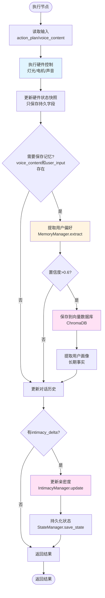

#### 3.6.5 硬件控制执行

```python
def execute_hardware_control(action_plan: Dict) -> None:
    """执行硬件控制"""
    # 灯光控制
    if "light" in action_plan:
        light_params = action_plan["light"]
        # 调用硬件接口
        set_light_brightness(light_params.get("brightness"))
        set_light_color_temp(light_params.get("color_temp"))
        # ...
    
    # 电机控制
    if "motor" in action_plan:
        motor_params = action_plan["motor"]
        # 调用硬件接口
        set_motor_vibration(motor_params.get("vibration"))
        # ...
    
    # 声音播放
    if "sound" in action_plan:
        sound_file = action_plan["sound"]
        # 播放声音文件
        play_sound(sound_file)
```

#### 3.6.6 硬件状态更新

```python
def update_hardware_state(current_hw: Dict, action_plan: Dict) -> Dict:
    """更新硬件状态快照（只保存持久字段）"""
    PERSISTENT_LIGHT_FIELDS = {"brightness", "color_temp", "status", "color"}
    PERSISTENT_MOTOR_FIELDS = {"speed", "status", "vibration"}
    
    # 更新灯光状态
    if "light" in action_plan:
        for k, v in action_plan["light"].items():
            if k in PERSISTENT_LIGHT_FIELDS:
                current_hw["light"][k] = v
    
    # 更新电机状态
    if "motor" in action_plan:
        for k, v in action_plan["motor"].items():
            if k in PERSISTENT_MOTOR_FIELDS:
                current_hw["motor"][k] = v
    
    return current_hw
```

#### 3.6.7 记忆保存

```python
def save_memory(user_input: str, voice_content: str, memory_manager: MemoryManager) -> None:
    """保存用户记忆"""
    # 1. 提取用户偏好
    preference = memory_manager.extract_user_preference(user_input, voice_content)
    if preference and preference.get("confidence", 0) > 0.6:
        memory_manager.save_user_memory(
            preference["content"],
            {"category": preference.get("category"), "confidence": preference["confidence"]}
        )
    
    # 2. 提取用户画像（长期事实）
    memory_manager.extract_and_save_user_profile(user_input, voice_content)
```

#### 3.6.8 亲密度更新

```python
def update_intimacy(state: LampState, intimacy_delta: float, reason: str) -> None:
    """更新亲密度"""
    intimacy_manager = IntimacyManager()
    new_level = intimacy_manager.update_intimacy(
        state.get("intimacy_level", 30.0),
        intimacy_delta,
        reason
    )
    
    # 更新状态
    state["intimacy_level"] = new_level
    state["intimacy_rank"] = intimacy_manager.get_intimacy_rank(new_level)
    
    # 持久化
    state_manager = StateManager()
    state_manager.save_state(state)
```

#### 3.6.9 边界情况处理

| 情况 | 处理方式 |
|:---|:---|
| `action_plan` 为空 | 跳过硬件控制，只更新对话历史 |
| `voice_content` 为空 | 跳过语音输出，只执行硬件控制 |
| 硬件控制失败 | 记录错误，继续执行记忆保存 |
| 记忆提取失败 | 记录错误，不阻塞执行 |
| 亲密度更新失败 | 记录错误，不阻塞执行 |
| 状态持久化失败 | 记录错误，但状态已在内存中更新 |

---

## 四、完整工作流图

### 4.1 主工作流（LangGraph结构）

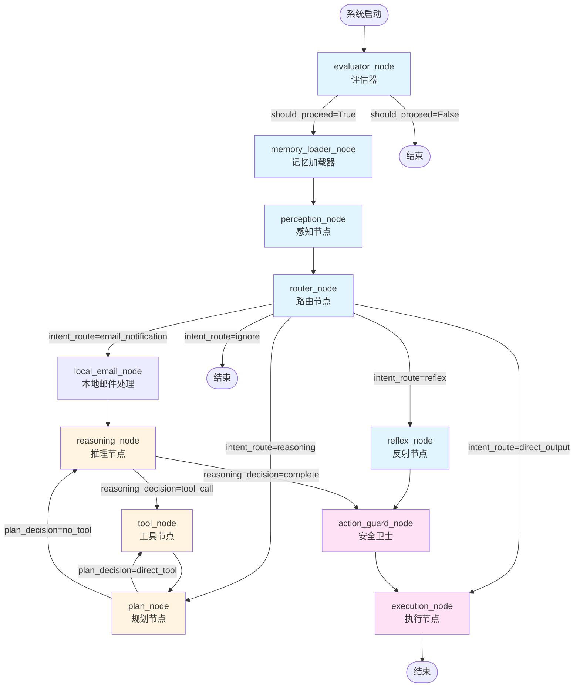

**图例**：
- 🔵 蓝色：第一层（逻辑判断层）
- 🟠 橙色：第二层（LLM推理层）
- 🩷 粉色：安全与执行层

### 4.2 工具调用循环详细流程

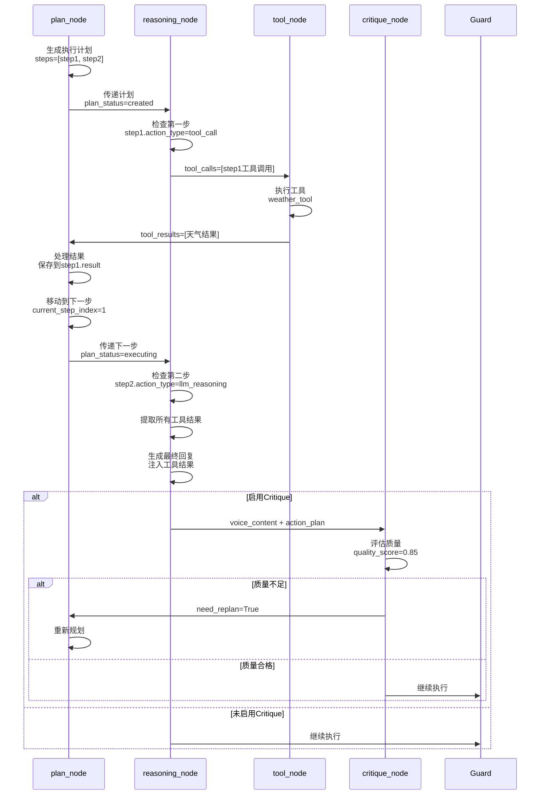

---

## 五、数据流图

### 5.1 状态字段流转

```mermaid
flowchart LR
    A[user_input] --> B[memory_context]
    B --> C[intent_route]
    C --> D[execution_plan]
    D --> E[tool_calls]
    E --> F[tool_results]
    F --> G[voice_content]
    G --> H[action_plan]
    H --> I[history]
    
    style A fill:#e1f5ff
    style B fill:#e1f5ff
    style C fill:#e1f5ff
    style D fill:#fff4e1
    style E fill:#fff4e1
    style F fill:#fff4e1
    style G fill:#ffe1f5
    style H fill:#ffe1f5
    style I fill:#ffe1f5
```

### 5.2 状态转换图

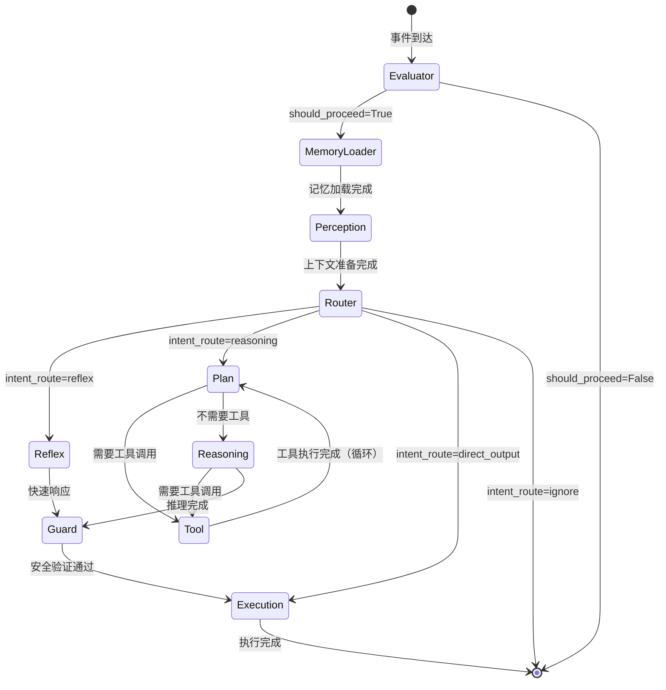

---

## 六、决策函数详细设计

### 6.1 should_proceed_decision

```python
def should_proceed_decision(state: LampState) -> str:
    """决定是否继续处理"""
    should_proceed = state.get("should_proceed", False)
    return "proceed" if should_proceed else "skip"
```

### 6.2 route_decision

```python
def route_decision(state: LampState) -> str:
    """路由决策"""
    intent_route = state.get("intent_route", "reflex")
    return intent_route
```

### 6.3 plan_decision

```python
def plan_decision(state: LampState) -> str:
    """规划节点后的路由决策"""
    plan_status = state.get("plan_status")
    tool_calls = state.get("tool_calls", [])
    
    # 如果计划已完成，进入推理
    if plan_status == "completed":
        return "no_tool"
    
    # 如果有工具调用，直接执行工具
    if tool_calls:
        return "direct_tool"
    
    # 否则进入推理
    return "no_tool"
```

### 6.4 reasoning_decision

```python
def reasoning_decision(state: LampState) -> str:
    """推理节点后的路由决策"""
    tool_calls = state.get("tool_calls", [])
    
    # 如果需要调用工具
    if tool_calls:
        return "tool_call"
    
    # 否则完成
    return "complete"
```

### 6.5 critique_decision（待实现）

```python
def critique_decision(state: LampState) -> str:
    """反思节点后的路由决策"""
    need_replan = state.get("need_replan", False)
    
    if need_replan:
        return "need_replan"
    
    return "continue"
```

---

## 七、错误处理策略

### 7.1 节点级错误处理

每个节点都应该有try-catch包装：

```python
def node_name(state: LampState) -> Dict[str, Any]:
    try:
        # 主要逻辑
        result = process_logic(state)
        return result
    except Exception as e:
        # 错误处理
        print(f"⚠️ {node_name}错误: {e}")
        return get_fallback_result(state, e)
```

### 7.2 降级策略

| 节点 | 降级策略 |
|:---|:---|
| `evaluator_node` | 默认 `should_proceed=True`（避免阻塞） |
| `memory_loader_node` | 返回空上下文，不阻塞 |
| `router_node` | 默认 `intent_route="reasoning"` |
| `plan_node` | 生成简单计划，不阻塞 |
| `reasoning_node` | 返回默认回复，不阻塞 |
| `tool_node` | 返回错误结果，继续处理其他工具 |
| `critique_node` | 默认 `need_replan=False`（避免过度重新规划） |
| `action_guard_node` | 允许执行，记录警告 |
| `execution_node` | 记录错误，继续执行其他步骤 |

### 7.3 超时控制

| 操作 | 超时时间 |
|:---|:---|
| LLM调用 | 60秒 |
| 工具执行 | 5秒 |
| MCP调用 | 10秒 |
| 向量检索 | 3秒 |

---

## 八、性能指标

### 8.1 响应时间目标

| 路径 | 目标响应时间 |
|:---|:---|
| 反射路径（reflex） | < 100ms |
| 简单推理（无工具） | < 2s |
| 中等推理（1个工具） | < 4s |
| 复杂推理（2+工具） | < 8s |

### 8.2 资源消耗目标

| 资源 | 目标 |
|:---|:---|
| 内存 | < 500MB（不含向量数据库） |
| CPU | 空闲时 < 5%，活跃时 < 30% |
| 存储 | 向量数据库 < 100MB（MVP阶段） |

### 8.3 LLM调用优化

- **第一层**：不使用LLM（规则判断）
- **第二层**：最小化LLM调用次数
  - 简单任务：0次LLM调用（规则生成计划）
  - 中等任务：1次LLM调用（推理生成回复）
  - 复杂任务：2次LLM调用（规划+推理）

---

## 九、实施检查清单

### 9.1 架构设计完成度

- [x] 两层架构定义清晰
- [x] 每个节点职责明确
- [x] 每个节点输入输出定义完整
- [x] 每个节点处理流程详细
- [x] 决策树完整
- [x] 边界情况处理明确
- [x] 错误处理策略完善
- [ ] Critique节点实现（待实现）

### 9.2 文档完整性

- [x] 架构总览
- [x] 第一层详细设计
- [x] 第二层详细设计
- [x] 完整工作流图
- [x] 数据流图
- [x] 决策函数设计
- [x] 错误处理策略
- [x] 性能指标

---

**文档版本**：v2.0  
**创建日期**：2025-01-XX  
**最后更新**：2025-01-XX  
**状态**：设计完成，待实施
