# 周期性事件记忆机制

本文档描述 Neko_light 项目中关于周期性事件的记忆和管理机制。

---

## 概述

周期性事件功能分为两个核心部分：

1. **主动日程管理**：用户主动创建的循环日程/提醒（如"每周五下班提醒我"）
2. **被动模式识别**：系统从对话历史中自动识别时间规律（如"每月10号发工资"）

---

## 涉及文件

| 文件 | 功能 |
|------|------|
| [schedule_manager.py] | 日程管理器核心：循环事件的创建、存储、下次发生时间计算 |
| [pattern_scanner.py] | 模式扫描器：从 ChromaDB 中识别周期性规律 |
| [memory_manager.py] | 记忆管理：保存带时间元数据的用户记忆 |
| [tools.py] | 工具接口：`create_schedule_tool` 支持循环参数 |
| [data/schedules.json] | 日程数据持久化存储 |

---

## 主动日程管理（ScheduleManager）

### 循环类型支持

```python
recurrence = {
    "type": "daily" | "weekly" | "monthly" | "yearly",
    "interval": 1,                    # 间隔数量（默认1）
    "days_of_week": [0, 4],           # 仅 weekly：0=周一, 6=周日
    "day_of_month": 10                # 仅 monthly：每月几号
}
```

### 核心方法

| 方法 | 说明 |
|------|------|
| `add_schedule(..., recurrence)` | 添加日程，支持循环规则 |
| `_calculate_next_occurrence(schedule, after_ts)` | 计算循环事件的下一次发生时间 |
| `check_upcoming(window_minutes)` | 检查即将触发的提醒（含循环事件） |
| `mark_reminded(id, occurrence_ts)` | 标记循环事件的某次发生已提醒 |

### 循环事件去重机制

循环事件使用 `last_reminded_at` 字段记录上次提醒的发生时间，避免重复提醒：

```python
# 非循环事件
schedule["reminded"] = True  # 一次性标记

# 循环事件
schedule["last_reminded_at"] = occurrence_ts  # 记录本次发生时间
```

---

## 被动模式识别（PatternScanner）

### 工作原理

1. 扫描 ChromaDB 中的用户记忆
2. 按 `day_of_month` 或 `weekday` 元数据分组
3. 识别同一天出现 ≥2 次的相似内容
4. 将高置信度规律写入 UserProfile

### 检测类型

| 类型 | 示例 | 日期格式 |
|------|------|----------|
| `monthly` | 每月10号发工资 | `*-10` |
| `weekly` | 每周五说"终于周末了" | `W4`（周五） |

### 核心方法

| 方法 | 说明 |
|------|------|
| `scan_monthly_patterns()` | 扫描月度规律 |
| `scan_weekly_patterns()` | 扫描周度规律 |
| `_cluster_by_content(events)` | 按内容相似度聚类（关键词匹配） |
| `consolidate_to_profile(patterns)` | 将规律写入 Profile.important_dates |

### 置信度计算

```python
confidence = min(1.0, occurrences / 5.0)  # 出现5次以上置信度为1.0
```

---

## 记忆存储中的时间元数据

`save_user_memory()` 保存记忆时自动附加时间元数据：

```python
metadata = {
    "timestamp": now,
    "creation_time": now,
    "date": "2024-01-10 14:30:00",
    "day_of_month": 10,      # 用于月度模式识别
    "weekday": 2,            # 用于周度模式识别（0=周一）
    "month": 1,              # 用于年度模式识别
    "importance": 5          # 重要性评分
}
```

> [!NOTE]
> `day_of_month` 和 `weekday` 字段是 PatternScanner 识别规律的关键依赖。

---

## 用户接口（tools.py）

### create_schedule_tool 参数

```python
create_schedule_tool(
    title: str,                    # 标题
    datetime_ts: float,            # 首次发生时间戳
    schedule_type: str,            # "schedule" | "reminder" | "todo" | "note"
    reminder_minutes: int,         # 提前提醒分钟数
    description: str,              # 描述
    recurrence_type: str,          # "daily" | "weekly" | "monthly" | None
    recurrence_value: int          # weekly: 周几(0-6), monthly: 日期(1-31)
)
```

### 使用示例

```python
# 每周五提醒
create_schedule_tool("周报提醒", ts, "reminder", 0, "", "weekly", 4)

# 每月10号提醒
create_schedule_tool("还信用卡", ts, "reminder", 0, "", "monthly", 10)

# 每天提醒
create_schedule_tool("喝水", ts, "reminder", 0, "", "daily", None)
```

---

## 数据流图

```mermaid
flowchart TD
    subgraph 主动创建
        A[用户: 每周五提醒我] --> B[create_schedule_tool]
        B --> C[ScheduleManager.add_schedule]
        C --> D[schedules.json]
    end
    
    subgraph 提醒触发
        E[定时检查] --> F[check_upcoming]
        F --> G[_calculate_next_occurrence]
        G --> H{在窗口内?}
        H -->|是| I[触发提醒]
        I --> J[mark_reminded]
    end
    
    subgraph 被动识别
        K[对话记录] --> L[save_user_memory]
        L --> M[ChromaDB + 时间元数据]
        M --> N[PatternScanner.scan_all_patterns]
        N --> O[consolidate_to_profile]
        O --> P[Profile.important_dates]
    end
```



---

## 测试文件

| 文件 | 说明 |
|------|------|
| [tests/test_schedule_manager.py](file:///Users/JiajunFei/Documents/%E5%BC%80%E6%99%AE%E5%8B%92/Neko_light/tests/test_schedule_manager.py) | 日程管理器单元测试（含循环事件测试） |

---

## 相关文档

- [memory_retrieval_scoring.md](file:///Users/JiajunFei/Documents/%E5%BC%80%E6%99%AE%E5%8B%92/Neko_light/docs/architecture/memory_retrieval_scoring.md) - 记忆检索评分机制
